```{r setup, include=FALSE}
knitr::opts_chunk$set(echo = FALSE)
html_tag_audio <- function(file, type = c("mp3")) {
  type <- match.arg(type)
  htmltools::tags$audio(
    controls = "",
    htmltools::tags$source(
      src = file,
      type = glue::glue("audio/{type}", type = type)
    )
  )
}
```
# Contenidos

.small[
* Estadística y R
* Instalación de R
* La consola de R y Rstudio
* Primer script de R utilizando R-studio
* Introducción a R
* Estructuras de datos
  * Vectores
  * Ejercicio: Vectores
  * Matrices
  * Ejercicio: Matrices
  * Data.frame
  * Un factor no es igual que un vector
  * Ejercicio: Data.frame
  * Lista
  * Data.frame vs List
* Rstudio: Características básicas
* Rstudio: El directorio de trabajo
* Rstudio: Crear un proyecto (OPCIONAL)
* Rstudio: Importar un conjunto de datos
* La ayuda en R
* Paquetes de R
]

---


# Estadística y R

<center>

</center>

* En esta primera parte vamos a dar los primeros pasos en R. Empezamos explicando qué es R y cómo utilizar el programa.

---

# Instalación de R

* La página principal del proyecto R se encuentra en [https://www.r-project.org/](https://www.r-project.org/)

<center>
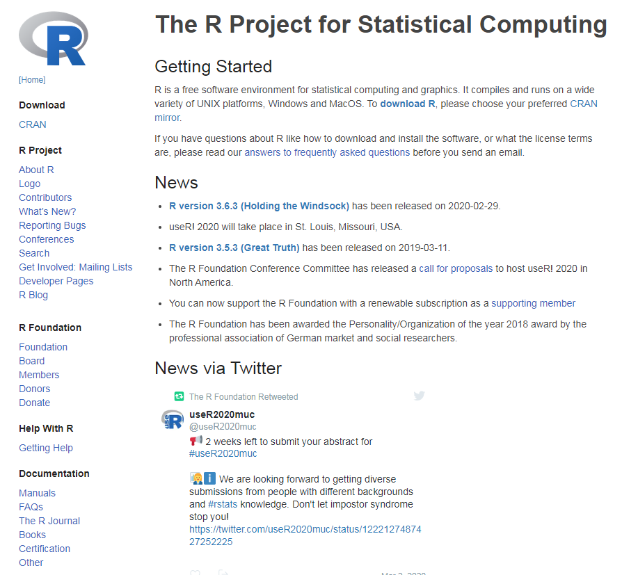
</center>

---

# La consola de R y Rstudio

* Una vez instalado, podríamos empezar a utilizar R simplemente con la consola o terminal

<center>
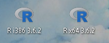
</center>
<center>
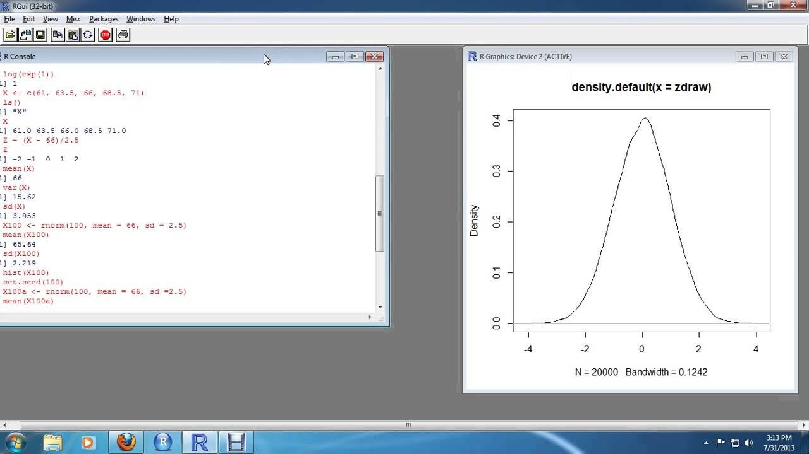
</center>


---

# La consola de R y Rstudio

* Sin embargo, lo más recomendable es utilizar el programa R-studio (de la empresa del mismo nombre) que se encuentra en [https://rstudio.com/](https://rstudio.com/)

<center>

</center>

---

# La consola de R y Rstudio

.pull-left[
* El programa Rstudio proporciona un IDE para

    * Trabajar con R y gráficos de R de forma interactiva.
    * Organizar el código y mantener múltiples proyectos.
    * Gestión de los paquetes de R (instalación, actualización,..).
    * Compartir código y colaborar con otros usuarios.
<center>
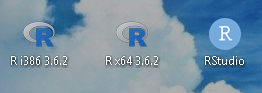
</center>

]
.pull-right[
<center>

</center>
]

---

# Primer script de R utilizando R-studio

* Hacemos click en el icono __+__ verde del editor de scripts (izquierdo superior), y elegimos __R Script__.

<center>
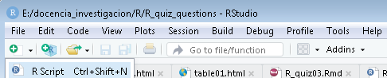
</center>
<center>

</center>

* Las acciones más interesantes sobre un script de R son:

    * __Disco__: salvar el fichero.
    * __Lupa__: buscar y reemplazar.
    * __Varita mágica__: herramientas útiles (lo veremos luego).
    * __Run__: ejecuta el código seleccionado (__Ctrl+Enter__).
    * __Re-Run__: ejecuta el último código que seleccionamos.
    * __Cuaderno__: compila el script R a un fichero HTML (lo veremos luego). 
    
#  

<br><br><br><br>
    
<p align="center">
    <h1>Introducción a los conceptos básicos de R</h1>
</p>

---

# Introducción a R

* Empezamos aprendiendo cómo realizar operaciones aritméticas en R. 

* Escribamos en la consola, o bien en el script, y ejecutamos 

```{r calc01, echo = TRUE}
# El símbolo de numeral # es utilizada para hacer comentarios
# Calcula 3 + 4
3 + 4

# Calcula 6 + 12

```

---

# Introducción a R

* El uso más simple que se le puede dar a R es el de una calculadora. 

    * Adición: `+`
    * Resta: `-`
    * Multiplicación: `*`
    * División: `/`
    * Exponenciación: `^`
    * Modulo: `%%`
    * Comparación: <,==,>,<=,>=,!=

```{r calc02, echo = TRUE}
# Adición, resta, multiplicación y división
( (5 + 5) - 4 ) /2

# Exponenciación. Calcular el cubo de 9

# Calcular el resto de la división de 17 entre 3

# Comparar si 7 es menor que 4

```

---

# Introducción a R

* Para guardar una valor en una variable lo hacemos mediante el operador __<-__ 
* También se puede utilizar el operador __=__ aunque lo usual es utilizar __<-__ 

```{r var03, echo = TRUE}
# Guardar el valor de 5 en x
x <- 5

# Visualiza el contenido de la variable x
x

# Guardar el valor de '6' en y, y visualizar

# Sumar x e y

```

---

# Introducción a R

* En R hay muchos tipos de datos. Los más básicos son

    * Decimales como 4.5, llamados **numeric** (numéricos).
    * Números enteros como 4 , llamados **integer** (enteros).
    * Valores Booleanos (**TRUE** para Verdadero o **FALSE** para Falso), llamados **logical** (lógicos).
    * Texto o alfanumérico (cadenas de caracteres), llamados **character** (caracteres).

```{r var04, echo = TRUE, eval=FALSE}
# Declarando las variables de diferentes tipos
var_nume <- 40
var_char <- "cuarenta"
var_logi <- FALSE 

# ¿cómo saber el tipo de una variable?
class(...)

```

* En las variables de texto es importante especificar las comillas
```{r var05, echo = TRUE, eval=FALSE}
var_char <- cuarenta

```


---

# Estructuras de datos

* Veamos cómo son las estructuras básicas de datos en R. 

<center>

</center>

---

# Estructuras de datos: Vectores

* Empezamos por el **vector**. Se trata de un grupo de elementos del mismo tipo o clase (numérico, caracter o lógico).

* Por ejemplo, el vector $x=[ 1 \: 2  \: 3  \: 4  \: 5]$ se expresa en R como
```{r vec05, echo = TRUE, eval=FALSE}
# Vector que empieza en 1 y acaba en 5 con separación de 1 entre cada elemento
x <- 1:5   
# Lo más usual es utilizar el operador combinar c()
x <- c(1,2,3,4,5,8,13)
y <- c("casa","coche","mesa")

#Longitud de un vector
length(x)

# Para acceder a un elemento de un vector
x[2]    # ¿qué elementos selecciona?
y[1:3]  # ¿qué elementos selecciona?
x[-1]   # ¿qué elementos selecciona?

```

---

# Estructuras de datos: Vectores

* ¿Que pasa si los elementos del vector tienen diferente tipo?
```{r vec06, echo = TRUE, eval=FALSE}
z <- c(1,2,"casa")

# ¿qué ha pasado con el vector z?
class(...)

```

* Lo que ha ocurrido en el vector **z** se le llama *coerción* (combinar datos de distinto tipo en un vector)

<center>
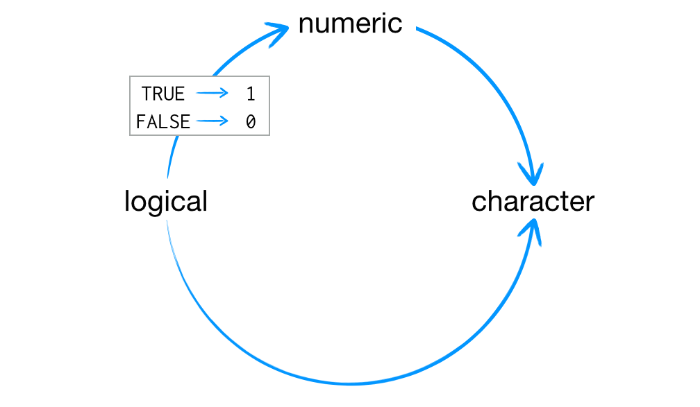
</center>

---

# Estructuras de datos: Vectores

* Los siguientes comandos permiten crear vectores con otros patrones
```{r vec07, echo = TRUE, eval=FALSE}
# Crear un vector que empieza en 1, termina en 20 y va de 2 en 2
seq(1,20,by=2)  
# Repetir un valor un número de veces
rep(1,5)
# Repetir un vector un número de veces 
rep(1:3,each=2,times=3)

```

---

# Ejercicio: Vectores

* Gimli y Légolas se desafían mutuamente a matar el mayor número de enemigos
```{r}
html_tag_audio("img/lords.mp3", type = "mp3")
```
<center>
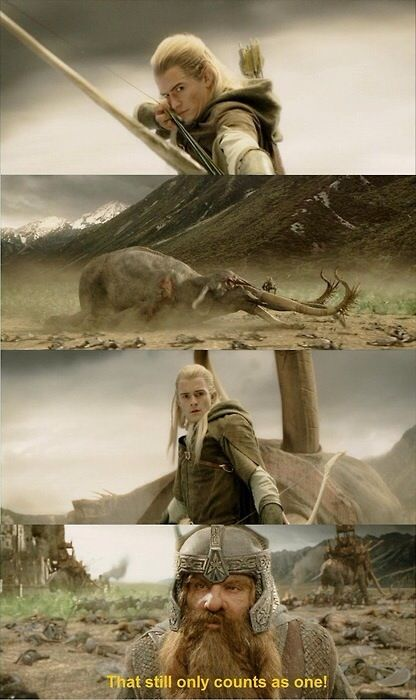
</center>

---
# Ejercicio: Vectores

* El vector `killed.orcs` tiene en las posiciones impares la cuenta de Légolas y 
en las posiciones pares la cuenta de Gimli. ¿Quén ha matado más orcos?

```{r vec08b, echo = FALSE, eval=FALSE}
legolas <- killed.orcs[(1:10) %% 2 == 1]
gimli <- killed.orcs[(1:10) %% 2 == 0]
```
```{r vec08, echo = TRUE, eval=FALSE}
killed.orcs <- c(2,5,1,0,4,5,13,8,9,10)

legolas <- killed.orcs[...]  # poner los índices pares que hay de 1 a 10
gimli <- killed.orcs[...]    # poner los índices impares que hay de 1 a 10
sum(legolas)>sum(gimli)

```

<center>
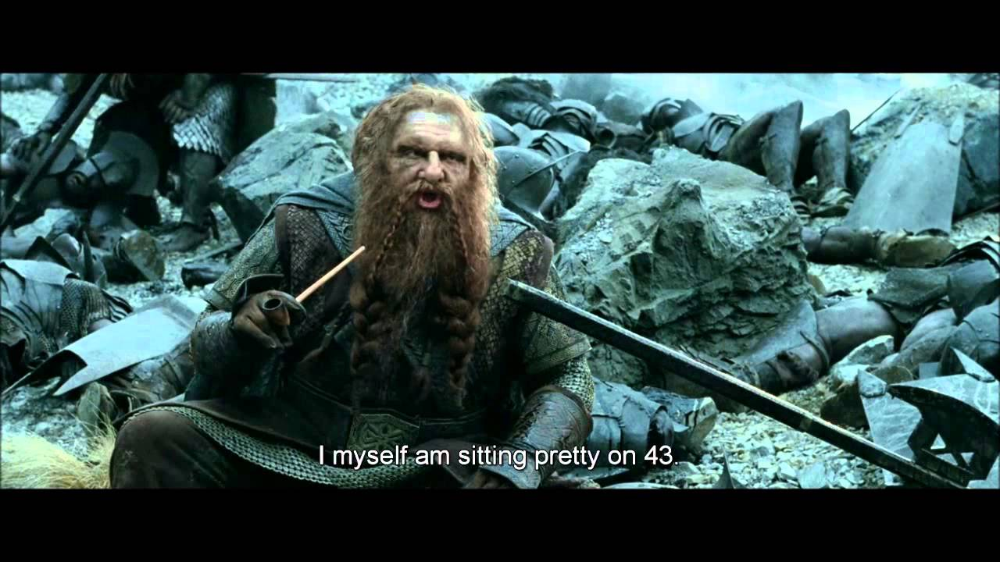
</center>

---
# Estructuras de datos: Vectores

* Ahora que ya sabemos cómo se construyen los vectores veamos cómo hacer operaciones con ellos
```{r vec09, echo = TRUE, eval=FALSE}
# Suma, resta, multiplicación, división y comparación
x <- c(-2,5,3,0)
y <- c(1,2,0,0)

x+y
x-y
x*y
x/y  # ¿qué ha pasado con el último elemento?
x>y

# Realizar la suma y multiplicación de los siguientes vectores 
# ¿Qué problema se presenta?
x <- 1:5
y <- 1:2
```

---

# Estructuras de datos: Matrices

* La siguiente estructura es **matrix**. Se trata de una estructura de 2D con elementos del mismo tipo o clase (numérico, caracter o lógico) arreglados de forma rectangular en filas y columnas. 
```{r matr10, echo = TRUE, eval=FALSE}
# Matriz de 1 hasta 12 con 3 filas y 4 columnas 
m <- matrix(1:12,nrow=3,ncol=4) 
m
# Queremos que la matriz se rellene por filas y no por columnas
?matrix
m <- matrix(1:12,nrow=3,ncol=4,....) 
m

#Clase y dimesion del objeto m
class(...)
dim(...)
```

---

# Estructuras de datos: Matrices


<center>
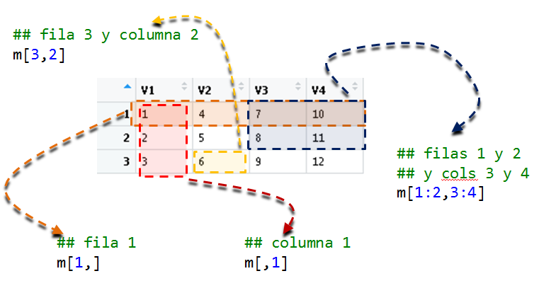
</center>


---
# Estructuras de datos: Matrices

* Construimos matrices a partir de vectores

```{r matr10bis, echo = TRUE, eval=FALSE}
# cbind() y rbind() son dos comandos que sriven 
# para unir vectores en columna o en fila
x <- 1:3
y <- 4:6
m1 <- cbind(x,y)
m1
m2 <- rbind(x,y)
m2

# Crear una matriz con la primera columna de las 
# muertes de Légolas y la segunda con las de Gimli

```

---
# Estructuras de datos: Matrices

* De nuevo, cuidado si los vectores no tienen la misma longitud
```{r matr11, echo = TRUE, eval=FALSE}
x <- 1:5
y <- 1:2
cbind(x,y)

```

* ¿Cómo se realiza la multiplicación de matrices? Buscar en la ayuda "matrix multiplication" y realizar el producto de las matrices m1 y m2.
```{r matr12, echo = TRUE, eval=FALSE}
m1%*%m2

```

---
# Ejercicio: Matrices

* ¿Qué fruta se consume más y cual es el valor de la producción? (Fuente: [ISTAC](http://www.gobiernodecanarias.org/istac/estadisticas/sectorprimario/))
<table>
  <tr>
    <td></td>
    <td></td>
    <td></td>
  </tr>
</table>


* Crear una matriz `frutas` cuyas columnas sea la producción (en 1,000 kg) de estas frutas entre 2014 y 2018.

```{r matr13, echo = TRUE, eval=FALSE}
nispe <- c(212.9,	199.8,	197.4,	196.0,	196.0)
aguac <- c(8879.8,	11001.1,	9427.2,	10328.0,	9808.0)
kiwis <- c(55.3, 52.3,	48.0,	46.0,	45.0)
```

```{r matr13b, echo = FALSE, eval=FALSE}
# podemos cambiar el nombre de columnas con colnames() y el de filas con rownames()
frutas <- cbind(nispe,aguac,kiwis)   
colnames(frutas) <- c("nisperos","aguacates","kiwis")
rownames(frutas) <- c(2018,2017,2016,2015,2014)
```
```{r matr13c, echo = TRUE, eval=FALSE}
# podemos cambiar el nombre de columnas con colnames() y el de filas con rownames()
frutas <- cbind(... , ... , ...)   
colnames(frutas) <- c(  ,  ,  )
rownames(frutas) <- c( ,  ,  ,  ,  )
```


---
# Ejercicio: Matrices

* Arya Stark está de visita por el suroeste de Westeros viendo todo aquello.

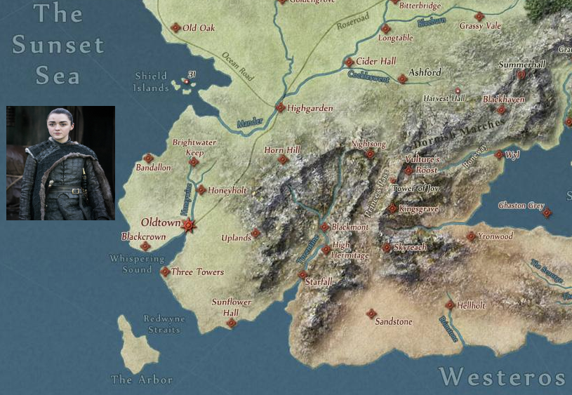

* En su viaje, Arya busca la mejor ruta para ir de Old a Brig pasando antes por una ciudad intermedia para descansar.
```{r matr15, echo = FALSE, eval=FALSE}
sum(dist.arya["Old","Banda"]+dist.arya["Banda","Brig"])
sum(dist.arya["Old","Honey"]+dist.arya["Honey","Brig"])
sum(dist.arya["Old","Uplands"]+dist.arya["Uplands","Brig"])
```
```{r matr15b, echo = TRUE, eval=FALSE}
dist.arya <- matrix(c(0,120,200,105,120,120,0,40,70,180,200,40,0,10,250,105,70,10,0,75,120,180,75,10,0),nrow=5)
#vamos a ponerle nombres a las filas y las columnas
rownames(dist.arya) <- colnames(dist.arya)<-c("Old","Brig","Banda","Honey","Uplands")
sum(dist.arya[1,3]+dist.arya[3,2])  # ¿se puede calcular mejor aprovechando 
                                    # que las filas y columnas tiene nombre?
```


---
# Estructuras de datos: Data.frame

* Veamos ahora la estructura **data.frame**. Similar a la estructura de matrix, solo que ahora las columnas pueden ser de distinto tipo o clase. Es decir, todos los elementos de una columna deben de ser del mismo tipo, pero las columnas pueden ser de distintos tipos.
* A las columnas del data.frame las llamaremos **variables** y a las filas **observaciones**.

```{r df15, echo = TRUE, eval=FALSE}
# Data.frame con 4 variables (observar que las 3 primeras son vectores texto 
# y la última es numérica)
matricula <- data.frame(rama="Ciencias",
                          grado=rep(c("Matemáticas","Física","Biología"),each=2),
                          genero=rep(c("Mujer","Hombre"),3),
                          num.alus=c(36,49,24,46,54,46))

#Clase, dimesion y estructura del objeto dat
class(...)
dim(...)
str(...)

```

---
# Estructuras de datos: Data.frame

<center>
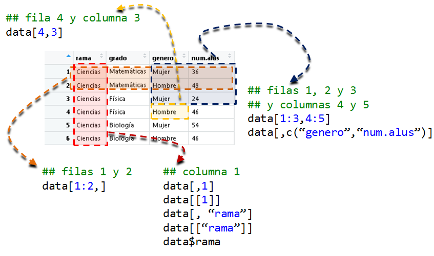
</center>

---
# Estructuras de datos: Data.frame

* Ahora sí se produce error cuando se intenta crear un **data.frame** utilizando vectores de diferente longitud.
```{r df16, echo = TRUE, eval=FALSE}
data.frame(x=1:3,y=1:5)
```

* Comprobar la clase de cada variable del data.frame `matricula`
```{r df17, echo = TRUE, eval=FALSE}
class(matricula$num.alus)
class(matricula$....) 
```


---
# Estructuras de datos: Un factor no es igual que un vector

* Un **factor** es un tipo de datos asociado a variables categóricas de un **data.frame** y que tienen un número limitado de categorías que se llaman niveles (**levels**).
```{r df18, echo = TRUE, eval=FALSE}
levels(matricula$...)
```

.pull-left[
* Es importante distinguir en R si estamos trabajando con una variable numérica (discreta o continua) o categórica, debido a que los modelos estadísticos y los análisis de datos tratan estos tipos de manera diferente.
```{r df19, echo = TRUE, eval=FALSE, fig.width=5, fig.height=5}
meses <- data.frame(mes=c("marzo","abril",
                       "mayo","junio"),
                 num.dias=c(31,30,31,30),
                 stringsAsFactors = FALSE)
barplot(num.dias~mes,data=meses)   
# ¿Pero qué ha pasado?
```

]

.pull-right[
```{r df19b, echo = FALSE, eval=TRUE, fig.width=5, fig.height=5}
meses <- data.frame(mes=c("marzo","abril","mayo","junio"),
                 num.dias=c(31,30,31,30),
                 stringsAsFactors = FALSE)
barplot(num.dias~mes,data=meses)   # ¿Pero qué ha pasado?
```
]

---
# Estructuras de datos: Un factor no es igual que un vector

* Habría que especificar que `mes` es un factor y especificar el orden de los niveles.
```{r df20, echo = TRUE, eval=FALSE}
meses$mes <- factor(meses$mes,levels=c("marzo","abril","mayo","junio"))
barplot(num.dias~mes,data=meses)
```

---
# Ejercicio: Data.frame

<center>

</center>


```{r df21, echo = TRUE, eval=FALSE}
planetas <- c("Mercurio", "Venus", "Tierra", "Marte", "Jupiter", 
              "Saturno", "Urano", "Neptuno");
tipo <- c("Planeta Terrestre", "Planeta Terrestre", "Planeta Terrestre", 
          "Planeta Terrestre", "Gigante Gaseoso", "Gigante Gaseoso", 
          "Gigante Gaseoso", "Gigante Gaseoso")
diametro <- c(0.382, 0.949, 1, 0.532, 11.209, 9.449, 4.007, 3.883); 
rotacion <- c(58.64, -243.02, 1, 1.03, 0.41, 0.43, -0.72, 0.67);
anillos <- c(FALSE, FALSE, FALSE, FALSE, TRUE, TRUE, TRUE, TRUE);

# Crear el data frame:
planetas_df <- data.frame(planetas,tipo,diametro,rotacion,anillos)
# Ver la estructura del data.frame
str(...)
```


---
# Estructuras de datos: Lista

* Finalmente, vemos la estructura de lista **list**. Una lista es un grupo de objetos que pueden ser, no sólo de diferente clase, sino también de diferente tamaño. 

```{r lista16, echo = TRUE, eval=FALSE}
# Lista con distintos elementos de la matricula
lista <- list(curso="2017-18", 
            convoca=c("Septiembre","Enero","Junio","Julio"),
            matr=matricula)
lista
```

* Muchas de las funciones que se utilizan en R devuelven como resultado una lista de elementos
```{r lista17, echo = TRUE, eval=FALSE}
histog <- hist(matricula$num.alus)
histog
```

---
# Data.frame vs List

* La diferencia entre data.frame y list se puede describir así
<center>
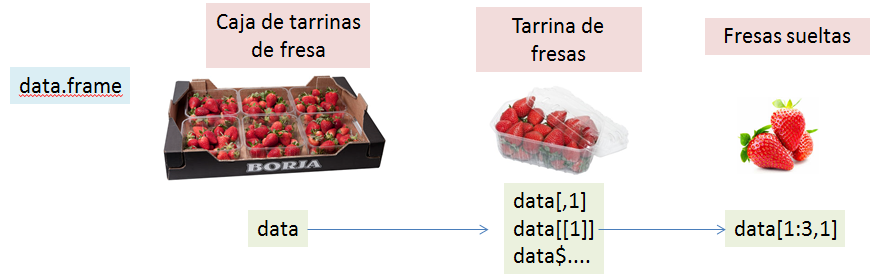
</center>

<center>
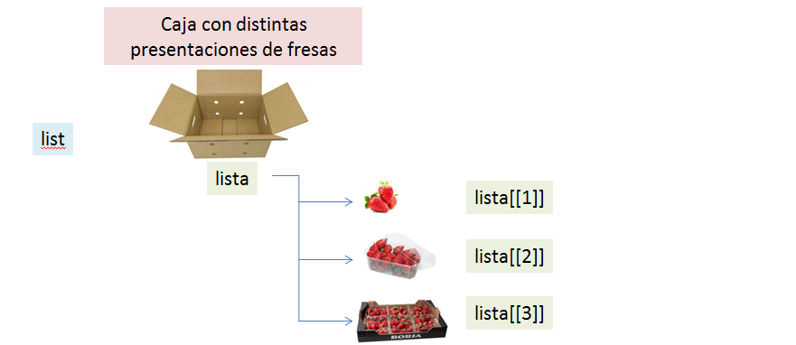
</center>


---
# Rstudio: Características básicas

* La estructura de data.frame() es la que se suele utilizar para cargar en R los datos con los que uno desea trabajar.
```{r dffile19, echo = TRUE, eval=FALSE}
read.table(....,file=....,header=...,sep=...,stringsAsFactors = ...)
```

* El programa RStudio nos ayuda a utilizar este comando gracias a la opción de "Import Dataset"

<center>
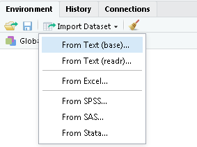
</center>

* Pero antes de probar la opción de importar datos es importante que sepamos algo más de Rstudio.


---
class: inverse, mline, center, middle

# Gracias


Esta presentación se ha creado con la librería [**xaringan**](https://github.com/yihui/xaringan),
utilizando [remark.js](https://remarkjs.com), [**knitr**](http://yihui.org/knitr), y [R Markdown](https://rmarkdown.rstudio.com).
