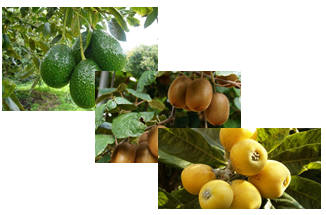

# Contenidos

.small[
* 1.Visualización básica
  * 1.1 Visualización básica: las librerías graphics 
  * 1.1 Visualización básica: datos de sueño de mamíferos
* 2.Gráfico histograma (graphics)
  * 2.1 Ejercicio: realizar un histograma 
  * 2.2 Otros aspectos básicos del comando hist()
* 3.Gráfico de barras (graphics)
  * 3.1 Ejercicio: realizar un gráfico de barras
  * 3.2 Gráfico de barras de una tabla de fecuencias
  * 3.3 Ejercicio: tabla de fecuencias y gráfico de barras (I)
  * 3.4 Gráfico de barras de una tabla de resumen estadístico
  * 3.5 Ejercicio: tabla resumen y un gráfico de barras (I)
* 4.Gráfico de cajas (graphics)
  * 4.1 Ejercicio: gráfico de cajas 
* 5.Gráfico de dispersión (el comando plot)
  * 5.1 Ejercicio: gráfico de dispersión
  * 5.2 Gráfico de dispersión (el comando plot)
* 6.Gráfico de líneas (el comando plot)
* 7.Gráficos avanzados
* 8.Ejercicio: gráfico con leyenda

]

---

# 1. Visualización básica

* En R hay una serie de gráficas básicas que podemos obtener de forma sencilla
   + Histograma
   + Gráfico de barras
   + Gráfico de cajas
   + Gráfico de dispersión
   + Gráfico de líneas
  
<div >
  <div >
    
    
    
  </div>
  <div >
        
        
  </div>
</div>


---

# 1.1 Visualización básica: las librerías graphics 

* La librería `graphics` se carga por defecto cuando se comienza una sesión de R. 

* Hay otras alternativas en R que nos ayudarán a obtener gráficos de mayor complejidad pero empezaremos viendo las posibilidades de `graphics`.

* En esta librería disponemos de los siguientes métodos para realizar las gráficas que hemos comentado:
   + Para representar un histograma tenemos las funciones `hist`
   + El gráfico de barras se obtiene con `barplot`
   + Un gráfico de cajas lo obtenemos con `boxplot`
   + Para el gráfico de dispersión utilizaremos `plot`
   
---

# 1.1 Visualización básica: datos de sueño de mamíferos


* Vamos a explicar los gráficos anteriores utilizando un conjunto de datos sobre el sueño en mamíferos y su exposición a peligros durante su descanso.

<table><tr>
<td>

</td>
<td>

</td>
<td>

</td>
</tr></table>

---

class: small

# 1.1 Visualización básica: datos de sueño de mamíferos

* Las variables son las siguientes
  * especie: especie mamífero
  * peso_cuerpo: peso del cuerpo en kg.
  * peso_cerebro: peso del cerebro en kg.
  * no_suenho: horas de descanso sin sueño
  * suenho: horas de descanso con sueño
  * descanso: tiempo total de descanso (domir) 
  * tiempo_vida: tiempo de vida en años
  * tiempo_gestacion: tiempo de gestación en días
  * predacion: índice de predación ("probabilidad baja de ser depredado", "probabilidad moderada de ser depredado", "probabilidad alta de ser depredado") 
  * exposicion: índice de esposición mientras duerme ("exposición menor", "exposición moderada", exposición mayor")
  * peligro: índice de peligro que enfrenta al encarar a otros animales ("peligro escaso de otros animales", "peligro moderado de otros animales", "peligro mayor de otros animales").
  * talla: talla del animal ("tamaño pequeño", "tamaño normal", "tamaño grande")
  

```{r data01, echo = FALSE, eval=FALSE, fig.height=5}
# leer datos de sueño
sleep<-read.table("data1/datos_sleep.txt",header=TRUE,sep="\t",quote="")

sleep$talla<-ifelse(sleep$peso_cuerpo<10, "little size",ifelse(sleep$peso_cuerpo<200,"normal size","large size"))
sleep$predacion<-ifelse(sleep$predacion<3, "less preyed",ifelse(sleep$predacion<5,"moderate preyed","more preyed"))
sleep$exposicion<-ifelse(sleep$exposicion<3, "less exposed",ifelse(sleep$exposicion<5,"moderate exposed","more exposed"))
sleep$peligro<-ifelse(sleep$peligro<3, "less danger",ifelse(sleep$peligro<5,"moderate danger","more danger"))
write.table(sleep,file="data1/datos_sleep2.txt",row.names = FALSE, quote=FALSE,sep="\t")
```

```{r data02, echo = TRUE, eval=FALSE, fig.height=5}
# leer datos de sueño
#install.packages(readr)
library(readr)
sleep <- read_delim("https://raw.githubusercontent.com/cpgonzal/cursoIntroR2020/master/data/datos_sleep2.txt", 
        "\t", escape_double = FALSE, trim_ws = TRUE)
head(sleep)
```

```{r data03, echo = FALSE, eval=TRUE, fig.height=5}
sleep<-read.table("data1/datos_sleep2.txt",header=TRUE,sep="\t",quote="")
```


---

# 2. Gráfico histograma (graphics)

* El histogram es el gráfico que nos ayuda a representar los valores **de una variable numérica** agrupada en intervalos (breaks) y muestra la distribución de frecuencias en estos intervalos. 

```{r hist01, echo = FALSE, fig.height=5, fig.align = 'center'}
# leer datos calidad aire
#aire<-read.table("data/datos_calidad_aire.csv",header=TRUE)
#hist(aire$Temp,col="#8DD3C7",main="Histograma de temperatura")
```

```{r hist02, echo = TRUE,eval=FALSE, fig.height=5, fig.align = 'center'}
hist(sleep$tiempo_vida,col="#8DD3C7",main="Histograma del tiempo de vida")
```


---

# 2. Gráfico histograma (graphics)

* Podemos personalizar diferentes características del histograma como los intervalos de clase. Especificando la opción  `freq=TRUE` obtenemos un histograma de frecuencias absolutas.

```{r hist03, echo = TRUE, fig.height=5, fig.align = 'center'}
hist(sleep$tiempo_vida,
     col="#8DD3C7",                  # color
     freq=TRUE,                      # frecuencias absolutas o densidades prob.
     breaks=c(0,20,40,60,80,100),    # intervalos de clase
     xlab="Tiempo de vida", ylab="Frecuencias absolutas",  # etiquetas eje y e y       
     main="Histograma del tiempo de vida")                 # título
```

        
---

class: 
# 2.1 Ejercicio: realizar un histograma (I)

.pull-left3[

<left>

</left>

]

.pull-right3[

.small[
Realizar un histograma de la variable `descanso`:
* No hace falta especificar `breaks`
* Poner un título al gráfico
* Etiquetar los ejes del gráfico
* Escoger un color para las barras del histograma 
]

]

.small[
* Puedes ejecutar `colors()` para ver nombres de colores admitidos en R. También puedes utilizar el código RGB de un color y los comandos siguientes te pueden ayudar a escoger el color.
]

.pull-left2[

```{r color02, echo = TRUE, eval=FALSE, out.width = "50%"}
n<-20 # número de colors de la paleta
pie(rep(1,n), col=rainbow(n))
rainbow(5)
```

```{r color03, echo = FALSE, eval=TRUE, out.width = "50%"}
rainbow(5)
```


]

.pull-right2[
```{r color04, echo = FALSE, eval=TRUE, out.width = "30%"}
n<-20 # número de colors de la paleta
pie(rep(1,n), col=rainbow(n))
```

]

<br/>
```{r ejerc01, echo = TRUE, eval=FALSE, out.width = "50%"}
# Ejercicio 1 (copiar en Rscript y completar) 
hist(... = )
```

---


# 2.1 Ejercicio: realizar un histograma (II)

.pull-left3[

<left>

</left>

]

.pull-right3[

* Podemos intentar mejorar la apariencia del gráfico especificando la opción `breaks`


]

* Especificar la opción `breaks` separando los valores de 5 en 5 (puedes empezar desde el mínimo y acabar en el máximo de `sleep$descanso`).

```{r ejerc02, echo = TRUE, eval=FALSE, out.width = "50%"}
# Ejercicio 2 (copiar en Rscript y completar) 
hist(... = )
```


* Repetir el histograma especificando ahora la opción `breaks` separando los valores de 2 en 2 (recuerda cómo puedes generar una secuencia numérica con el comando `seq`).
```{r hist04a, echo = FALSE, eval=FALSE, fig.height=4}
hist(sleep$descanso,col="#8DD3C7", 
     breaks=c(seq(0,20,2)),
     xaxt="n",
     xlab="Horas de descanso",
     ylab="Frecuencias absolutas",
     main="Histograma de la duración del descanso")
axis(1,at=seq(0,20,2))
```

```{r ejerc03, echo = TRUE, eval=FALSE, out.width = "50%"}
# Ejercicio 3 (copiar en Rscript y completar) 
hist(... = )
```
---


# 2.1 Ejercicio: realizar un histograma (III)

.pull-left3[

<left>

</left>

]

.pull-right3[

* Hacer un histograma de `descanso` primero para los animales de `talla` pequeña y luego los de `talla` grande.


]

* Recordar que puedes filtrar `sleep$descanso` para los animales de una talla determinada utilizando el  comando `filter` de la librería `dplyr` (también os sirve el comando `subset` del paquete base)
```{r hist04b, echo = TRUE, eval=FALSE}
sleep_normal<-subset(sleep,talla=="normal size" ])
sleep_normal$descanso

...

library(dplyr)
sleep_normal<-filter(sleep,talla=="normal size" ])
sleep_normal$descanso
```


---
class: normal 
# 2.2 Otros aspectos básicos del comando hist()


* Observamos que `hist` retorna no sólo un gráfico sino un objeto lista con diferentes atributos del gráfico.

```{r hist04c, echo = TRUE, eval=FALSE, size="tiny", fig.align = 'center'}
h1 <- hist(sleep$tiempo_vida)
h1
```
```{r hist04d, echo = FALSE,eval=TRUE, size="tiny", fig.align = 'center'}
h1 <- hist(sleep$tiempo_vida,plot = FALSE)
h1
```

---

# 2.2 Otros aspectos básicos del comando hist()

* Si queremos representar un histograma de frecuencias relativas tenemos que dividir los `counts` por la suma total.

```{r hist05, echo = TRUE, fig.height=5, fig.align = 'center'}
h1$counts<-h1$counts/sum(h1$counts)
plot(h1,col="#8DD3C7", 
     xlab="Tiempo de vida",ylab="Frecuencias relativas",
     main="Histograma del tiempo de vida")
```


---


# 3. Gráfico de barras (graphics)

* El gráfico de barras compara valores de **una variable numérica frente a otra de tipo nominal**. Recordemos el ejemplo de la matriz con los datos de producción de  frutas de Canarias

.pull-left2[.small[

<center>

</center>

]]


.pull-right2[.small[


```{r matr13b, echo = TRUE, eval=TRUE}
nispe <- c(196.0, 196.0, 197.4, 199.8, 212.9)
aguac <- c(9808.0, 10328.0,  9427.2, 11001.1,  8879.8)
kiwis <- c(45.0, 46.0, 48.0, 52.3, 55.3)
frutas <- cbind(nispe,aguac,kiwis)   
colnames(frutas) <- c("nisperos","aguacates","kiwis")
rownames(frutas) <- c(2014,2015,2016,2017,2018)
```

]]

.pull-left2[.small[

La matriz de datos es .....

|      | nisperos | aguacates | kiwis |
| -----| -------- | --------- | ----- |
| 2014 |    196.0 |    9808.0 |  45.0 |
| 2015 |    196.0 |   10328.0 |  46.0 |
| ...  |      ... |       ... |   ... |
| 2018 |    212.9 |    8879.8 |  55.3 |


]]

.pull-right2[.small[

.....y queremos representar la produc. de kiwis

```{r bar01a, echo = FALSE, fig.height=4, fig.align = 'center'}
barplot(frutas[,"kiwis"],col="#8DD3C7",main="Producción de kiwis",xlab="Año",ylab="Producción (en Tn)")
```

]]


---

 
# 3. Gráfico de barras (graphics)

* Queremos representar la producción (vble. numérica) frente al año (discreta), que viene en el nombre de la fila.

* Para hacer el gráfico de barras sólo tenemos que escribir el comando
```{r bar01b, echo = TRUE, fig.height=4, fig.align = 'center'}
barplot(frutas[,"kiwis"],
        col="#8DD3C7",                        # color
        main="Producción de kiwis",           # título
        xlab="Año",ylab="Producción (en Tn)") # etiquetas eje y e y
```


        
---

class: small
# 3.1 Ejercicio: realizar un gráfico de barras

.pull-left3[

<left>

</left>

]

.pull-right3[

* Hacer el gráfico de barras de la producción de las otras dos frutas. Utilizar colores representativos de las frutas.


]


* ¿Se pueden representar las barras de forma horizontal? (NOTA: Ver la ayuda de `barplot`)

```{r bar01c, echo = FALSE, fig.height=4, fig.align = 'center'}
barplot(frutas[,"kiwis"],col="#8DD3C7",main="Producción de kiwis",ylab="Año",xlab="Producción (en Tn)",
        horiz=TRUE,xlim=c(0,80))
```

```{r ejerc04, echo = TRUE, eval=FALSE, out.width = "50%"}
# Ejercicio 4 (copiar en Rscript y completar) 
barplot(... = )
```


---

# 3.2 Gráfico de barras de una tabla de fecuencias

* También podemos hacer un gráfico de barras a partir de un data.frame (volvemos a nuestro ejemplo de datos del sueño de los animales)  

.pull-left2[.small[

A partir de una tabla de frecuencias .....

| peligro        | especie |
| -------------- | ------- |
| less danger    |     33  |
| moderate danger|     20  |
| more danger    |      9  |


]]


.pull-right2[.small[

....podemos hacer un gráfico de barras

```{r bar03a, echo = FALSE, fig.height=4, fig.align = 'center'}
tab_peligro <- table(sleep$peligro)
# aggregate es un comando que se utiliza para crear
# tablas desagregadas de acuerdo a variables de una lista
tab_peligro<-aggregate(especie~peligro, sleep,length)

bar1<-barplot(especie~peligro,
        data=tab_peligro,
        ylim=c(0,40),
        col="#3300FF",xlab="Peligro", ylab="Número de especies", main="Número de especies según nivel de peligro")


## Add text at top of bars
#text(x = bar1, y = tab_peligro$especie, label = tab_peligro$especie, pos = 1, col = "red")
```
]]

---
class: small
# 3.3 Ejercicio: tabla de fecuencias y gráfico de barras (I)

.pull-left3[

<left>

</left>

]

.pull-right3[

* Para hacer una tabla de frecuencias podemos utilizar los comandos:
  * `group_by` de la librería `dplyr` 
  (https://rsanchezs.gitbooks.io/rprogramming/content/chapter9/groupby.html)
  * `summarise` de la librería `dplyr`
  (https://rsanchezs.gitbooks.io/rprogramming/content/chapter9/summarise.html)


]

```{r bar03f, echo = FALSE, message=FALSE, fig.height=4, fig.align = 'center'}
# table es un comando que se utiliza para crear tablas de frecuencias absolutas
library(dplyr)
tab_peligro <- table(sleep$peligro)
tab_peligro <- group_by(sleep,peligro)
tab_peligro <- summarize(tab_peligro,num=n())
```

```{r ejerc05a, echo = TRUE, eval=FALSE, out.width = "50%"}
# Ejercicio 5 primera parte (copiar en Rscript y completar) 
library(dplyr)
tab_peligro <- .....
```


* Y el gráfico se haría igual que antes, solo que ahora hay que especificar el data.frame en `data` y las variables en la forma `vble numérica ~ vble grupo` 
```{r bar03h, echo = FALSE, eval=FALSE, fig.width=6, fig.height=3, fig.align = 'center'}
barplot(num~peligro,
        data=tab_peligro,
        col="#3300FF",
        xlab="Peligro", ylab="Número de especies", 
        main="Número de especies según nivel de peligro")
```
```{r ejerc05b, echo = TRUE, eval=FALSE, fig.width=6, fig.height=3, fig.align = 'center'}
# Ejercicio 5 segunda parte (copiar en Rscript y completar) 
barplot(... ~ ...,
        data=...,
        col="....",
        xlab="....", ylab="....", 
        main="....")
```


---
class: small 
# 3.3 Ejercicio: tabla de fecuencias y gráfico de barras (II)

.pull-left3[

<left>

</left>

]

.pull-right3[

* Hacer el gráfico de barras para ver, ahora, la distribución de frecuencias de la variable `talla`.

]


```{r ejerc06, echo = TRUE, eval=FALSE, out.width = "50%"}
# Ejercicio 6 (copiar en Rscript y completar) 
tab_talla<- .....

barplot(... ~ ...,
        data=...,
        col="....",
        xlab="....", ylab="....", 
        main="....")

```

* ¿En qué orden salen las categorías de `talla`?
```{r bar03e, echo = FALSE, message=FALSE, fig.height=4, fig.align = 'center'}
#convertir primero a factor la variable talla
sleep$talla <- factor(sleep$talla, levels=c("little size", "normal size", "large size"))
#sleep$talla <- factor(sleep$talla, levels=c("little size", "normal size", "large size"),
#                      labels=c("pequeño","normal","grande"))
tab_talla <- table(sleep$talla)
tab_talla <- summarize(group_by(sleep,talla),num=n())

barplot(num~talla, 
        tab_talla,
        col="#00FFB2",
        xlab="Talla", ylab="Número de especies", 
        main="Número de especies según talla")
```


---

# 3.4 Gráfico de barras de una tabla de resumen estadístico

* También podemos utilizar el gráfico de barras en casos como el siguiente

.pull-left2[.small[

A partir de una tabla con un resumen estadístico de una variable .....

| peligro        | tiempo_medio_vida |
| -------------- | ----------------- |
| less danger    |            19.50  |
| moderate danger|            17.00  |
| more danger    |            27.00  |


]]


.pull-right2[.small[

....podemos hacer un gráfico de barras

```{r bar04a, echo = FALSE, fig.height=4, fig.align = 'center'}
# aggregate es un comando que se utiliza para crear
# tablas desagregadas de acuerdo a variables de una lista
tab_peligro<-aggregate(tiempo_vida~peligro, sleep,mean,na.rm=FALSE)
colnames(tab_peligro)<-c("peligro","tiempo_medio_vida")

barplot(tiempo_medio_vida~peligro,
        data=tab_peligro,
        col="#7F00FF",
        xlab="Peligro", ylab="Tiempo medio de vida", 
        main="Tiempo medio de vida según nivel de peligro")
```
]]

---

# 3.5 Ejercicio: tabla resumen y un gráfico de barras (I)

.pull-left3[

<left>

</left>

]

.pull-right3[

* De nuevo, con `group_by()` y `summarize()` hacemos el resumen para el promedio del tiempo de vida.


]

```{r ejerc07, echo = TRUE, eval=FALSE, out.width = "50%"}
# Ejercicio 7 (copiar en Rscript y completar) 
tab_vida_media<- .....

barplot(...~...,
        data=...,
        col=...,
        xlab="...", ylab="...", 
        main="...")
```


```{r bar04b, echo = FALSE, eval=FALSE}
# tabla con un resumen estadístico de una variable numérica
# desagregada de acuerdo a variables categóricas de una lista
tab_vida_media<-summarize(group_by(sleep,peligro) ,
                       tiempo_medio_vida=mean(tiempo_vida,na.rm=TRUE))

barplot(tiempo_medio_vida~peligro,
        data=tab_vida_media,
        col="#7F00FF",
        xlab="Peligro", ylab="Tiempo medio de vida", 
        main="Tiempo medio de vida según nivel de peligro")
```


---

# 4. Gráfico de cajas (graphics)

* El gráfico de cajas es, junto al histograma, uno de los gráficos más ampliamente utilizados para analizar una **variable numérica** (para ver la forma de la distribución, la posible presencia de valores atípicos). 
* El comando `boxplot` es similar a `hist` ya que sólo hace falta pasarle el vector de la variable. Vamos a verlo con la variable descanso.


```{r cajas02, echo = TRUE, fig.height=4, fig.width=6,fig.align = 'center'}
boxplot(sleep$descanso, 
        col="#8DD3C7",                     # color
        ylab = 'Descanso (en horas)',      # etiqueta eje y
        ylim = c(0,30),                    # límites de eje y 
        main = "Boxplot de horas de descanso")  # título
  
        
```


---

# 4.1 Ejercicio: gráfico de cajas 

.pull-left3[

<left>

</left>

]

.pull-right3[

* Hacer un diagrama de cajas para analizar `descanso` primero para los animales de `talla` pequeña, luego los de `talla` normal y finalmente los de `talla` grande (recordar que esto se puede hacer con `subset` o `filter`de dplyr).


]

```{r ejerc08, echo = TRUE, eval=FALSE, out.width = "50%"}
# Ejercicio 8 (copiar en Rscript y completar) 
boxplot(...,
        col=...,
        ylab="...", 
        main="...")
```

```{r cajas03, echo = FALSE, fig.height=4, fig.width=9,fig.align = 'center'}
par(mfrow=c(1,3))
boxplot(filter(sleep,talla=="little size")$descanso, 
        ylab = 'Descanso (en horas)',      
        col="green",                    
        ylim = c(0,20),                   
        main = "Boxplot vble. descanso (talla pequeña)") 

boxplot(filter(sleep,talla=="normal size")$descanso, 
        ylab = 'Descanso (en horas)',     
        col="red",                     
        ylim = c(0,20),                   
        main = "Boxplot vble. descanso (talla normal)")  

boxplot(filter(sleep,talla=="large size")$descanso, 
        ylab = 'Descanso (en horas)',      
        col="blue",                     
        ylim = c(0,20),                   
        main = "Boxplot vble. descanso (talla grande)")  
        
```

---

# 5. Gráfico de dispersión (el comando plot)

* El comando `plot` es uno de los comandos más utilizados en R para hacer gráficos. Lo vemos en este momento ya que es un comando que permite hacer gráficos de 1 o múltiples variables, y además admite bastantes opciones personalizadas.

* Vamos a utilizarlo para gráficos de dispersión. 
```{r scatter01, echo = TRUE, fig.height=4, fig.align = 'center'}
plot(sleep$suenho,sleep$descanso,                            # variables X e Y
     col="blue",                                             # color
     main="Relación entre sueño y tiempo total de descanso", # título
     xlab="Tiempo de sueño", ylab="Descanso")                # etiquetas de ejes X e Y
```

---

# 5. Gráfico de dispersión (el comando plot)

* Existen varios argumentos de `plot` que pueden ser muy interesantes para mejorar el gráfico.
  * __tipo de punto__: Se configura con el argumento `pch` de plot (ayuda en ?points)
  ```{r plot01, echo = FALSE, fig.height=3, fig.align = 'center'}
  generateRPointShapes<-function(){
    oldPar<-par()
    par(font=2, mar=c(0.5,0,0,0))
    y=rev(c(rep(1,6),rep(2,5), rep(3,5), rep(4,5), rep(5,5)))
    x=c(rep(1:5,5),6)
    plot(x, y, pch = 0:25, cex=1.5, ylim=c(1,5.5), xlim=c(1,6.5), 
         axes=FALSE, xlab="", ylab="", bg="blue")
    text(x, y, labels=0:25, pos=3)
    par(mar=oldPar$mar,font=oldPar$font )
  }
  generateRPointShapes()
  ```
  * __tipo de línea__: Se configura con el argumento `lty` de plot (ayuda en ?points)
  
  
  ```{r plot02, echo = FALSE, fig.height=3, fig.align = 'center'}
  generateRLineTypes<-function(){
    oldPar<-par()
    par(font=2, mar=c(0,0,0,0))
    plot(1, pch="", ylim=c(0,6), xlim=c(0,0.7),  axes=FALSE,xlab="", ylab="")
    for(i in 0:6) lines(c(0.3,0.7), c(i,i), lty=i, lwd=3)
    text(rep(0.1,6), 0:6, labels=c("0.'blank'", "1.'solid'", "2.'dashed'", "3.'dotted'",
                                   "4.'dotdash'", "5.'longdash'", "6.'twodash'"))
    par(mar=oldPar$mar,font=oldPar$font )
  }
  generateRLineTypes()
  ```

---

# 5. Gráfico de dispersión (el comando plot)

* También podemos cambiar otros atributos: 
* `cex`: argumento para controlar el __tamaño del punto__ (valor por defecto a 1).
* `lwd`: argumento para controlar el __grosor de línea__ (valor por defecto a 1).
* `col`: argumento para controlar el __color__ (ayuda en ?colors)

```{r plot03, echo = FALSE, fig.height=6, fig.align = 'center'}
generateRMapColors<-function() {
  # No margin around chart
  par(mar=c(0,0,0,0))
  
  # Empty chart
  plot(0, 0, type = "n", xlim = c(0, 1), ylim = c(0, 1), axes = FALSE, xlab = "", ylab = "")
  
  # Settings
  line <- 25
  col <- 5
  
  # Add color background
  rect(  
    rep((0:(col - 1)/col),line) ,  
    sort(rep((0:(line - 1)/line),col),decreasing=T),   
    rep((1:col/col),line) , 
    sort(rep((1:line/line),col),decreasing=T),  
    border = "white" , 
    col=colors()[seq(1,line*col)])
  
  # Color names
  text(  
    rep((0:(col - 1)/col),line)+0.1 ,  
    sort(rep((0:(line - 1)/line),col),decreasing=T)+0.015 , 
    colors()[seq(1,line*col)]  , 
    cex=1)
}
generateRMapColors()
```

---

# 5.1 Ejercicio: gráfico de dispersión

.pull-left3[

<left>

</left>

]

.pull-right3[

* Representar las variable `peso_cerebro` frente a `tiempo_vida` con algún color, tipo de punto 20 y tamaño del punto a 1.5


]

```{r ejerc09, echo = TRUE, eval=FALSE, out.width = "50%"}
# Ejercicio 9 (copiar en Rscript y completar) 
plot(..., ....,
        col=..., pch=...., cex=...,
        main="...",
        xlab="...", ylab="...")
```


```{r scatter03a, echo = FALSE, fig.height=5, fig.align = 'center'}
plot(sleep$peso_cerebro,sleep$tiempo_vida,
     col="darkorange",pch=20,cex=1.5,
     main="Relación entre peso de cerebro y tiempo de vida",
     xlab="Peso de cerebro (kg.)", ylab="Tiempo de vida (años)")
```


---

# 5.2 Gráfico de dispersión (el comando plot)

* Podemos incluir elementos en un gráfico utilizando una combinación de instrucciones.

* Por ejemplo, si queremos añadir una línea al gráfico hacemos los siguiente con el comando `abline` al que le podemos pasar los argumentos ´h´ o ´v´ para una línea horizontal o vertical, respectivamente:

.pull-left[


```{r scatter04a, echo = TRUE,eval=FALSE}
# trazar una recta vertical que pase a la altura de la media de X
# y una recta horizontal que pase a la altura de la media de Y
plot(x=sleep$suenho,y=sleep$descanso ,col="blue",pch=20,
     main="Relación entre sueño y tiempo total de descanso",
     xlab="Tiempo de sueño",
     ylab="Descanso")
abline(v=...,
       col="red",lty="dashed")
abline(h=...,
       col="red",lty="dashed")
```
]


.pull-right[

```{r scatter04b, echo = FALSE,eval=TRUE, fig.height=5, fig.align = 'center'}
plot(sleep$suenho,sleep$descanso ,col="blue",pch=20,
     main="Relación entre sueño y tiempo total de descanso",
     xlab="Tiempo de sueño",
     ylab="Descanso")
abline(v=mean(sleep$suenho,na.rm=TRUE),
       col="red",lty="dashed")
abline(h=mean(sleep$descanso,na.rm=TRUE),
       col="red",lty="dashed")
```
]

---

# 6.  Gráfico de líneas (el comando plot)

* El gráfico de líneas es idóneo para analizar tendencias o cambios relativos en las cantidades en los datos a lo largo del tiempo (o de cualquier otra variable).


```{r line02, echo = TRUE, fig.height=4, fig.align = 'center'}
año <- c(2014,2015,2016,2017,2018)
nisperos <- c(196.0, 196.0, 197.4, 199.8, 212.9)
aguacates <- c(9808.0, 10328.0,  9427.2, 11001.1,  8879.8)
kiwis <- c(45.0, 46.0, 48.0, 52.3, 55.3)
frutas <- data.frame(año,nispe,aguac,kiwis)   

plot(frutas$año,frutas$kiwis,col="green",
     main="Evolución de la producción de kiwis",
     xlab="Año",
     ylab="Producción (Tn)",
     type="b")
```


---

# 7. Gráficos avanzados

* Se puede comprobar que, en muchos comandos gráficos (como `hist` y `plot`), es necesario especificar las variables de los data.frames haciendo referencia primero a `data$...` delante del nombre de la variable.

* Una posible solución para evitar tener que poner `data$` antes de las variables sería utilizar el comando `attach`, que crea una copia en memoria de las variables de un dataset y así referirnos a ellas directamente por el nombre.
```{r scatter05, echo = TRUE,eval=FALSE, fig.height=5, fig.align = 'center'}
attach(sleep)
plot(peso_cerebro,tiempo_vida)
```

---


# 7. Gráficos avanzados

* Otra alternativa sería el comando with que permite anteponer el nombre de un dataset antes de la ejecución de un comando dado.
```{r scatter06, echo = TRUE,eval=FALSE, fig.height=5, fig.align = 'center'}
with(sleep, 
     plot(peso_cerebro,tiempo_vida)
)

with(sleep, 
     hist(peso_cerebro)
)
```

* Esta última alternativa es más clara ya que permite ver en todo momento a qué dataset pertenecen las variables.


---

# 7. Gráficos avanzados

* En los gráficos podemos, mediante colores, diferenciar grupos de observaciones de acuerdo a un factor.

* Por ejemplo, en el gráfico siguiente (`suenho` vs `descanso`) coloreamos de rojo los puntos que corresponden a animales de `talla pequeña`, de azul los de `talla normal` y de verde los de `talla grande`.

```{r scatter12, echo = FALSE,eval=TRUE, fig.height=5, fig.align = 'center'}
sleep$talla<-factor(sleep$talla,levels=c("little size", "normal size","large size"))
color_punto<-c("red","blue","green")
with(sleep,
     plot(suenho,descanso ,col=color_punto[talla],pch=20,
     main="Relación entre sueño y tiempo total de descanso",
     xlab="Tiempo de sueño",
     ylab="Descanso")
)
```


---

# 7. Gráficos avanzados

* En primer lugar, convertir la variable talla a factor
```{r scatter10a, echo = TRUE,eval=TRUE, fig.height=5, fig.align = 'center'}
# convertir a factor
sleep$talla<-factor(sleep$talla,levels=c("little size", "normal size","large size"))
```

* Ahora, creamos un vector con los colores que queremos
```{r scatter10b, echo = TRUE,eval=TRUE, fig.height=5, fig.align = 'center'}
color_punto<-c("red","blue","green") # especificar el color deseado 
                                     # para cada nivel de peligro
```

* Asociamos un color a cada punto según el nivel de la variable talla
```{r scatter10c, echo = TRUE,eval=TRUE, fig.height=5, fig.align = 'center'}
# crear vector de colores
colores_animales<-color_punto[sleep$talla]
```

* Finalmente, representamos el gráfico pasando este vector de colores al argumento `col`
```{r scatter10d, echo = TRUE,eval=FALSE, fig.height=5, fig.align = 'center'}
with(sleep,
     plot(suenho,descanso ,
          col=colores_animales,
          pch=20,
          main="Relación entre sueño y tiempo total de descanso",
          xlab="Tiempo de sueño",
          ylab="Descanso")
)

```


---

# 7. Gráficos avanzados

* En el gráfico anterior se necesita una leyenda para aclarar a qué grupo pertenece cada color.

* El comando `legend(x,y,...)` nos puede ayudar a colocar una leyenda en unas coordenadas `(x,y)`
o en una de las siguientes posiciones `x`:

<center>

</center>

---

# 8. Ejercicio: gráfico con leyenda

* Veamos cómo añadir la leyenda:
  * Utilizamos de nuevo el argumento `col` de `plot` para especificar los colores de cada punto. Dicho vector es `colores_animales`
  * Finalmente, especificar la leyenda en un lugar adecuado del gráfico y especificar en `legend` los niveles de la variable de grupo (¿?) y en `col` el color que ha de tener cada valor de la leyenda (¿?).

```{r scatter13, echo = TRUE,eval=FALSE, fig.height=5, fig.align = 'center'}
color_punto<-c("...","...","...") # especificar el color deseado 
                                  # para cada nivel de peligro
with(sleep,
     plot(suenho,descanso ,col=...,pch=20,   # especificar el vector de colores 
                                             # de cada punto
          main="Relación entre sueño y tiempo total de descanso",
          xlab="Tiempo de sueño",
          ylab="Descanso")
)
with(sleep,
     legend("bottomright",pch=20,
            legend=...,
            col=...))

```


---

# 8. Ejercicio: gráfico con leyenda

* El resultado final:
```{r scatter14, echo = FALSE,eval=TRUE, fig.height=7, fig.align = 'center'}
with(sleep,
     plot(suenho,descanso ,col=color_punto[talla],pch=20,
          main="Relación entre sueño y tiempo total de descanso",
          xlab="Tiempo de sueño",
          ylab="Descanso")
)
with(sleep,
     legend("bottomright",pch=20,
            legend=levels(talla),
            col=color_punto))

```


---
class: inverse, mline, center, middle

# Gracias


Esta presentación se ha creado con la librería [**xaringan**](https://github.com/yihui/xaringan),
utilizando [remark.js](https://remarkjs.com), [**knitr**](http://yihui.org/knitr), y [R Markdown](https://rmarkdown.rstudio.com).


