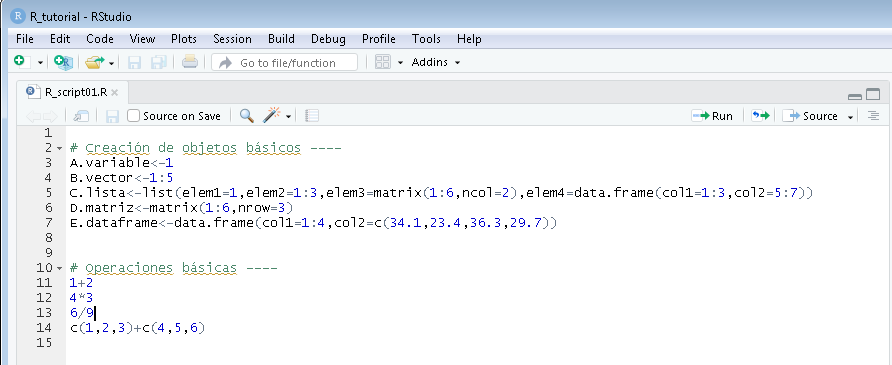
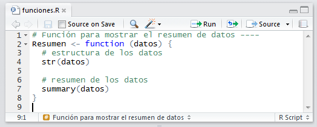
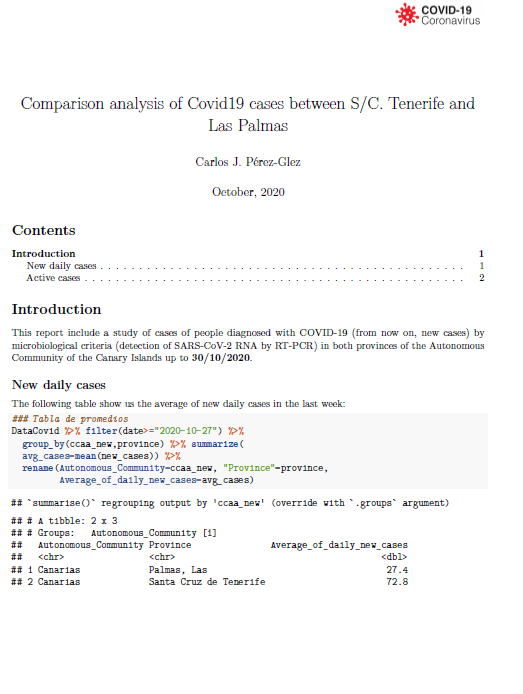
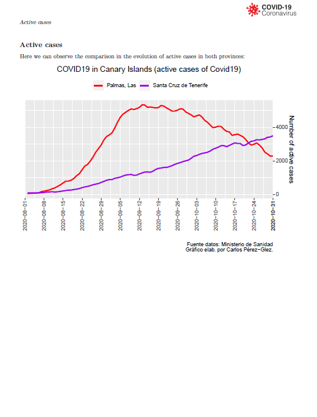
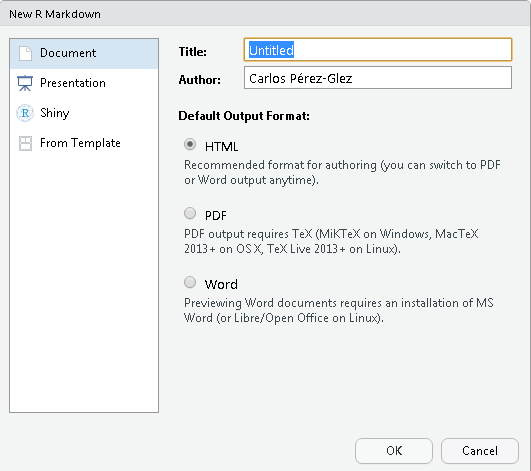
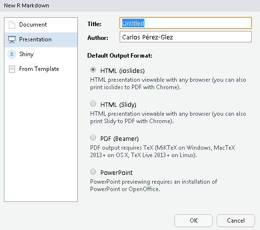
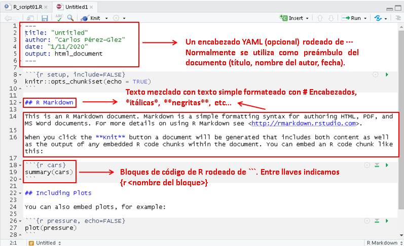

```{r setup, include=FALSE}
knitr::opts_chunk$set(echo = FALSE)
html_tag_audio <- function(file, type = c("mp3")) {
  type <- match.arg(type)
  htmltools::tags$audio(
    controls = "",
    htmltools::tags$source(
      src = file,
      type = glue::glue("audio/{type}", type = type)
    )
  )
}
```
# Contenidos

.small[
* R Scripts
  + Ejecución del código
  + Secciones del código
* R Markdown
  + Ejemplo de documento
  + Crear un archivo Rmarkdown
  + Documento markdown
  + ¿Qué es markdown?
  + Sintaxis básica de markdown
  + Bloques de código R (chunks)
  + Opciones de bloques de código
  + Ejercicio
]


---
class: inverse right middle title-slide2

# R Scripts


---
# R Scripts: ejecución del código
* El archivo `R Script` es el tipo de fichero más habitual (con extensión .R) que se utiliza para escribir código en R

<center>

</center>

* En los ficheros `R Script` se pueden ejecutar una o varias líneas de código haciendo click en el botón `Run` o pulsando `<Ctrl> + <Enter>`. Para ejecutar una línea del script sólo hace falta poner el cursor en la línea, no es necesario seleccionarla.

* El botón `Source` permite ejecutar todo el código contenido en el archivo de script.

---
# R Scripts: autocompletado
* En la venta de script también está disponible la función de autocompletado de funciones, como en la consola.


---
# R Scripts: secciones del código
* Una característica interesante de los scripts en RStudio es la posibilidad de estructurar el código en secciones.
* Las secciones se pueden crear poniendo un comentario (`#`) con un nombre de sección y acabado en 4 guiones (`----`)

```
# <NombreDeLaSección> ----
```

* Podemos aprovechar y añadir un comentario para nuestra primera sección del código:

<center>

</center>

* Fíjense que dicha sección aparece en la parte inferior del editor como __navegación del código__.

---
class: inverse right middle title-slide2

# R Markdown

---
# R Markdown: ejemplo de documento
* La opción de archivo `R Markdown` corresponde a un formato (con extensión .Rmd) que nos ayuda a generar documentos y presentaciones de texto y código R, al mismo tiempo, a modo de informes o trabajos. 
* Markdown es el nombre que tiene un tipo de lenguaje que se utiliza para escribir de forma sencilla, fácilmente comprensible, un texto que luego se puede publicar con un formato determinado.

.pull-left2[
<center>

</center>

]

.pull-right2[
<center>

</center>

]

---
# R Markdown: crear un archivo Rmarkdown

* En el menú `File->New File` seleccionamos la opción `R Markdown` 
<center>

</center>

* Es posible que RStudio nos pregunte si queremos instalar unas librerías adicionales, en cuyo caso responderemos afirmativamente para instalar todo lo necesario.

---
class: small
# R Markdown: crear un archivo Rmarkdown

* Tenemos varias opciones a la hora de crear archivos `R Markdown`: documento o presentación.

.pull-left2[
<center>

</center>

 
]

.pull-right2[
<center>

</center>


]

.vertical-center-100[
<br><br> <br><br> <br><br> <br><br> <br><br> <br><br> <br><br> <br><br> <br><br> 
* En el caso de **Documento** podemos elegir si queremos que el archivo `R Markdown` genere un documento en formato PDF, HTML o Word/Libre Office(odt). **NOTA IMPORTANTE** Para generar un documento PDF es necesario tener instalado el MikTex(Win), MacTex(Mac) o LiveTex(Linux).

* En el caso de **Presentación** podemos elegir entre varios estilos de presentación, incluyendo formato Powerpoint o Presentación Libre Office.
]

---
# R Markdown: documento markdown
* Escogemos la opción de documento en formato `HTML` y RStudio genera una plantilla en formato .Rmd con un ejemplo de referencia que podemos modificar.
<center>

</center>


---
# R Markdown: ¿qué es markdown?
* Como hemos dicho, es un `lenguaje de marcado ligero` que facilita generar documentos para publicar (p.e., en formato XHTML o HTML válido) sin necesidad de escribir etiquetas o instrucciones de estilo). Es muy fácil de aprender. 

* Se puede encontrar una guía completa en RStudio en el menú `Help`
  + Hoja de referencia de R Markdown : `Help > Cheatsheets > R Markdown Cheat Sheet`
  + Guía de referencia R Markdown : `Help > Cheatsheets > R Markdown Reference Guide`
  
* La sintaxis del lenguaje Markdown tiene los siguientes elementos
  + Párrafos y saltos de línea
  + Encabezados
  + Listas
  + Códigos de bloque
  + Reglas horizontales
  + Links o enlaces
  + Imágenes


---
# R Markdown: sintaxis básica de markdown

* Encabezados

````markdown
  # Encabezado de primer nivel
  ## Encabezado de segundo nivel 
  ### Encabezado de tercer nivel
````

* Formateo de texto

````markdown
  *cursiva*  (ó _cursiva_)
  **negrita**  (ó  __negrita__)
  `code`
  superscript^2^ 
  subscript~2~
````

* Listas

```markdown
- Primer item
- Siguiente item
- Siguiente item
    - Primer sub-item
    - Otro sub-item
```

---
# R Markdown: sintaxis básica de markdown

* Listas enumeradas

```markdown
  1. Primer item
  2. Segundo item 
  3. Tercer item
```

* Enlaces e imágenes

```markdown
[Web de la universidad de La Laguna](http://www.ull.es)


```

* Tablas 

```markdown
Primer encabezado     | Segundo encabezado
--------------------- | ---------------------
Contenido de la celda | Contenido de la celda
Contenido de la celda | Contenido de la celda
```  

---
# R Markdown: bloques de código R (chunks)

* Si queremos incluir un código de R y el resultado de su ejecución lo podemos hacer de la siguiente forma
````
```{r}`r ''`
x<-c(12,8,16,6)
mean(x)
```
````

* El documento en markdown mostraría el resultado de la ejecución en R
```{r, echo=TRUE, eval=TRUE, comment=""}
x<-c(12,8,16,6)
print(mean(x))
```


---
# R Markdown: opciones de bloques de código

* La salida de un bloque de código R se puede personalizar especificando opciones en la cabecera `{}`:
  + echo = FALSE: el código se ejecuta pero no se visualiza. Lo que sí se muestra es el resultado de la ejecución.
  + eval = FALSE: el código no se ejecuta. 

.pull-left2[
````
```{r, echo=FALSE}`r ''`
x<-c(12,8,16,6)
mean(x)
```
````

```{r, echo=FALSE, comment=""}
x<-c(12,8,16,6)
print(mean(x))
```
]

.pull-right2[
````
```{r, echo=TRUE, eval=FALSE}`r ''`
x<-c(12,8,16,6)
mean(x)
```
````

```{r, echo=TRUE, eval=FALSE, comment=""}
x<-c(12,8,16,6)
print(mean(x))
```
]

.vertical-center-100[
<br><br> <br><br> <br><br> <br><br> <br><br> <br><br>  
* Ver `R Markdown Reference Guide` en el menú `Help` para otras opciones de los bloques de código.
]
---
# R Markdown: ejercicio

* Se propone a los asistentes del curso elaborar un documento en markdown que contenga un título, nombre de su autor y la fecha de hoy en la cabecera YAML.

* Añadir una introducción que consista en una breve presentación del asistente (por ejemplo, se puede incluir qué titulación está cursando o ha terminado, la ocupación laboral si está trabajando, por qué está haciendo este curso, ...).

* En una sección de resultados del curso se pueden añadir diversos bloques de código de R con los ejemplos trabajados en esta sesión y en las de los próximas días. 

<center>

</center>


---
class: inverse, mline, center, middle

# Gracias


Esta presentación se ha creado con la librería [**xaringan**](https://github.com/yihui/xaringan),
utilizando [remark.js](https://remarkjs.com), [**knitr**](http://yihui.org/knitr), y [R Markdown](https://rmarkdown.rstudio.com).
