```{r setup, include=FALSE}
knitr::opts_chunk$set(echo = FALSE)
html_tag_audio <- function(file, type = c("mp3")) {
  type <- match.arg(type)
  htmltools::tags$audio(
    controls = "",
    htmltools::tags$source(
      src = file,
      type = glue::glue("audio/{type}", type = type)
    )
  )
}
```
# Contenidos

.small2[
* ¿Qué es RStudio?
* Características de Rstudio
* Descripción del entorno
* Panel de consola y terminal
  + Consola
  + Terminal
* Panel de entorno de trabajo e historial
  + Import Dataset
  + Entorno de trabajo
* Panel de ficheros, gráficos y ayuda
  + Directorio de trabajo
  + La ayuda en R
  + Paquetes de R
* Menus en RStudio (OPCIONAL)
  + Menú File
  + Menú Edit
  + Menú Code
  + Menú View
  + Menú Plots
  + Menú Session
  + Menú Build
  + Menú Debug
  + Menú Profile
  + Menú Tools
  + Menú Help
* Proyectos en RStudio (OPCIONAL)
  + Crear un proyecto
  


]


---
# ¿Qué es RStudio?

* RStudio es una herramienta __IDE (_Integrated Development Environment_)__ para __R__, libre y gratuita que facilita:
    * Trabajar con R y gráficos de R de forma interactiva.
    * Organizar el código y mantener múltiples proyectos.
    * Gestión de los paquetes de R (instalación, actualización,..).
    * Crear y compartir informes (utilizando un lenguaje llamado markdown).
    * Compartir código y colaborar con otros usuarios.
* RStudio es un programa desarrollado por la empresa del mismo nombre (la empresa ofrece servicios adicionales de consultoría y formación).
* RStudio __NO__ realiza ninguna operación estadística. Solo facilita realizar dichas operaciones sobre R.

<center>
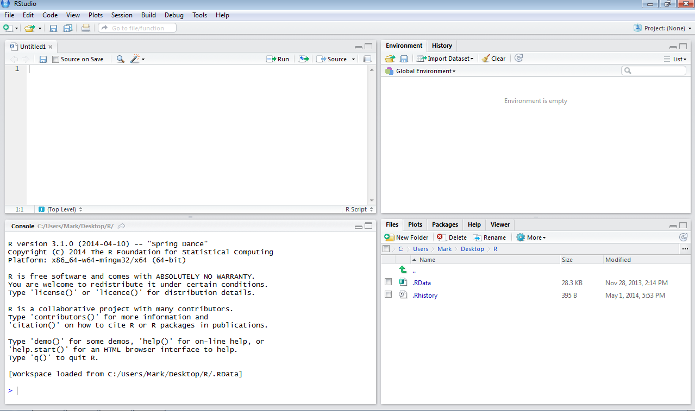 
</center>


---
# Características de Rstudio

* Integración de la consola de R dentro de Rstudio (se pueden teclear comandos de R directamente).

* Ejecución de código (permite ejecutar código directamente desde un fichero de script).

* Resaltado de la sintaxis (realiza un coloreado automático de los instrucciones y de las funciones).

* Ayuda con los paréntesis, corchetes y comillas (autocompleta estos símbolos al abrirlos).

* Completado de comandos (completa los comandos mientras se escriben usando la tecla `Tab`).

* Navegador de objetos (se pueden inspeccionar todos los objetos de la sesión de R).

---
# Características de Rstudio

* Gestión del historial de comandos.

* Navegación del código en la ventana de script (mediante secciones que finalizan en `----`).

* Importación y visualización de datos.

* Integración de gráficos (manipulación, zoom y exportación).

* Otros aspectos destacables son la gestión de proyectos (se puede cambiar de un proyecto a otro fácilmente), el control de versiones (se integra bien con `git` y `svn`) y la generación de documentos (tipo PDF, HTML y otros más avanzados con un solo click)


---
# Descripción del entorno

<center>
 
</center>

---
class: inverse right middle title-slide2

# Panel de consola y terminal

---
# Panel de consola y terminal: Consola

Desde RStudio podemos acceder a la consola de R (permite introducir comandos y sentencias para ejecutar de forma inmediata). Cada línea comienza con el símbolo `> `, a continuación se introduce el comando y se ejecuta al pulsar `<Enter>`.

<center>
 
</center>

La consola de R tiene algunas características muy interesantes. 

* Autocierre de paréntesis, corchetes, llaves, comillas, ....
```
# observar cómo se añade el paréntesis de cerrar al introducir el paréntesis de abrir
x<-c(1)   
```


---
# Panel de consola y terminal: Consola

* Autocompletado de comandos.
```
# empezar a escribir el comando siguiente 
sub
# observar el listado de comandos que comienzan por sub, moverse a subset 
# y pulsar la tecla <Tab>
subset()
# ahora volver a pulsar <Tab> para ver los argumentos con los que se invoca la función
```

---
# Panel de consola y terminal: Consola

* Historial de comandos: Podemos revisar los comandos que hemos introducido de varias formas
    * Pulsando las teclas de fecha arriba (&#x25B2;) se retrocede uno a uno hacia atrás. 
    * Pulsando __Ctrl+&#x25B2;__ se desplega un panel con los comandos históricos.
    * Revisando la pestaña __History__ al lado de __Environment__

<center>
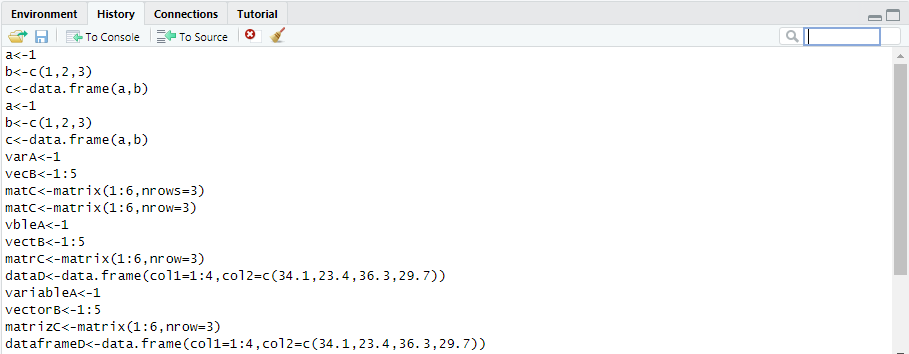 
</center>

En esta pestaña __History__ se pueden seleccionar uno o varios comandos usando la tecla `<Shift>` y luego ejecutar pulsando `<Enter>` o pulsando en __To Console__. El historial se puede borrar parcialmente con `<Supr>` o completamente haciendo click en el botón de la escoba.  


---
# Panel de consola y terminal: Consola


* Control de ejecución de comandos multilínea: Cuando se introduce un comando de R en varias líneas, R utiliza el símbolo `+` al principio de la línea hasta que se complete el comando.
<center>
 
</center>

**IMPORTANTE** Muchas veces, si no se ha cerrado correctamente un paréntesis, corchete, llave, comillas, ....la consola se queda en este estado temporal hasta que se introduzca el correspondiente caracter de cierre o pulsando `<ESC>`. La única forma de "desbloquear" R consiste en corregir esta omisión aquí mismo en la consola o cerrando la sesión de R (menú `Session`).

* Control de ejecución de comando: Cuando se introduce un comando de R que tarda bastante en ejecutar aparece un icono rojo de `STOP` con el cual se puede interrumpir la ejecución en caso de que la ejecución se alargue demasiado.
<center>
 
</center>


---
# Panel de consola y terminal: Terminal

* La pestaña __Terminal__ permite ejecutar desde dentro de RStudio un comando de sistema 
<center>
 
</center>

---
class: inverse right middle title-slide2

# Panel de entorno de trabajo e historial

---
# Panel de entorno de trabajo e historial: Import Dataset

* Ya hemos visto que en RStudio existe la opción de cargar datos externos a través de "Import Dataset" en la pestaña __Environment__ 

<center>

</center>


---
# Panel de entorno de trabajo e historial: Import Dataset

* Hay dos opciones básicas para cargar datos en formato plano (*.txt, *.csv) 

.pull-left2[

a) con read.table() o read.csv() de la librería __base__
<center>
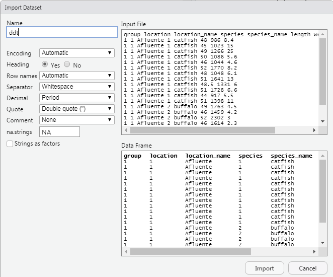
</center>
<br/>
]

.pull-right2[

b) con read\_csv() de la librería __readr__
<center>
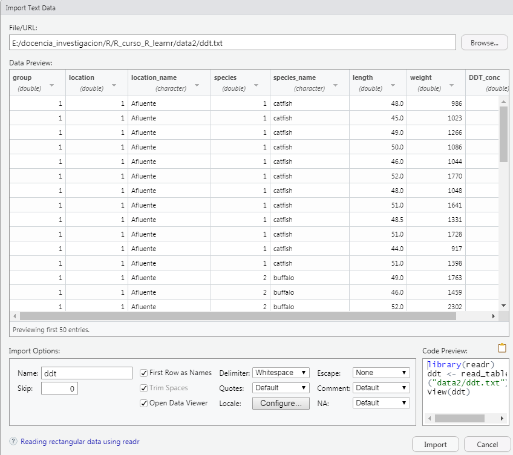
</center>
<br/><br/><br/>
]


* También se pueden cargar archivos de otros formatos (*.xls, *.ods, *.sav, *.sas)

---
# Panel de entorno de trabajo e historial: Import Dataset

* Ahora sí, vamos a importar un conjunto de datos. Descargamos el archivo [https://raw.githubusercontent.com/cpgonzal/cursoIntroR2018/gh-pages/ddt.txt](https://raw.githubusercontent.com/cpgonzal/cursoIntroR2018/gh-pages/ddt.txt) en nuestro directorio de trabajo. 

* Vamos a importar el conjunto de datos mediante "Import Dataset"
<center>

</center>
y seleccionamos la opción "From text (base)" (o "From text (readr)").

* Por ejemplo, con la opción "From text (base)" seleccionamos el archivo y RStudio deduce casi todas las opciones de importación:
    * __Heading__: si trae el nombre de la variable.
    * __Separator__: tipo de separador entre datos.
    * __Decimal__: símbolo para el punto decimal.
    * __Quote__: símbolo para los comentarios.


---
# Panel de entorno de trabajo e historial: Entorno de trabajo

* Además de la opción de "Import Dataset", en la pestaña __Environment__ podemos observar los objetos que hemos creado en nuestra sesión de R

* Supongamos que creamos las siguientes estructuras de datos
```{r proj21, echo = TRUE, eval=FALSE}
A.variable<-1
B.vector<-1:5
C.lista<-list(elem1=1,elem2=1:3,elem3=matrix(1:6,ncol=2),elem4=data.frame(col1=1:3,col2=5:7))
D.matriz<-matrix(1:6,nrow=3)
E.dataframe<-data.frame(col1=1:4,col2=c(34.1,23.4,36.3,29.7))
```

<center>
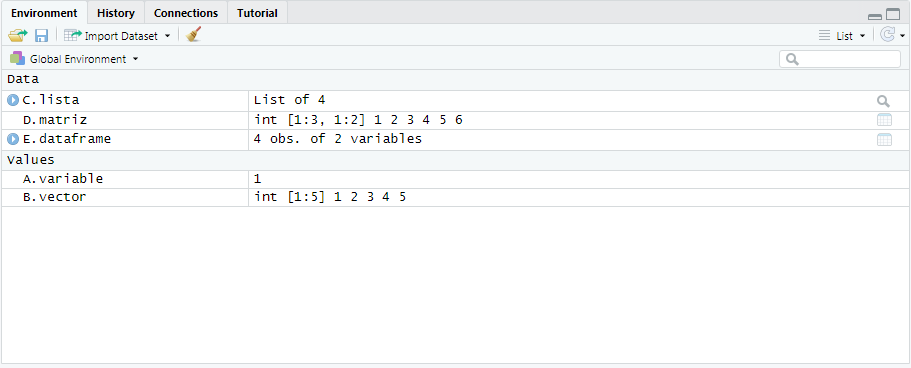 
</center>

---
# Panel de entorno de trabajo e historial: Entorno de trabajo

* Podemos examinar los atributos de los objetos pulsando en el icono de color azul y blanco. Si pinchamos sobre un objeto de tipo `Data` podemos visualizar las estructuras de datos que contiene.
<center>
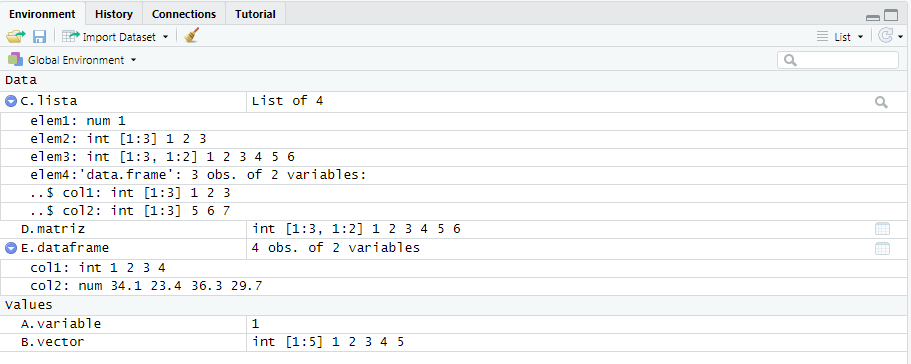 
</center>

---
class: inverse right middle title-slide2

# Panel de ficheros, gráficos y ayuda

---
# Panel de ficheros, gráficos y ayuda

* En RStudio hay un panel que nos permite gestionar los ficheros de nuestro sistema
<center>
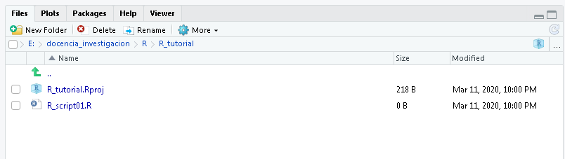
</center>

* En este panel podemos seleccionar una carpeta de nuestro ordenador en la que queramos trabajar (hacer click en `...`)  

* Seleccionamos la carpeta que nos interese y en el panel podemos visualizar su contenido.


---
# Panel de ficheros, gráficos y ayuda: directorio de trabajo

* Si queremos que en este trabajo se guarden y cargen los archivos con los que queramos trabajar, entonces podemos decirle a R que este será nuestro __directorio de trabajo__

<center>
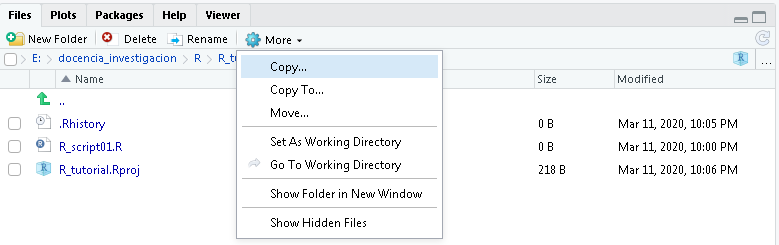
</center>

* Hacemos click en "Set as working directory" y Rstudio ejecuta el comando el comando `setwd(ruta_a_carpeta)`. 
* A partir de ahora, a R le será mucho más fácil encontrar los archivos ya que no necesitamos poner la ruta de acceso a los mismos. Podemos pasar directamente a la opción de "Imoprt dataset" para cargar un archivo.


---
# Panel de ficheros, gráficos y ayuda: la ayuda en R

* En R podemos acceder a la ayuda de un comando escribiendo `?` delante del comando que nos interese
```{r help01, echo = TRUE, eval=FALSE}
?mean
```

* También podemos acceder a la ayuda de un comando si lo escribimos en una venta de R-script, lo seleccionamos y pulsamos __F1__

---
# Panel de ficheros, gráficos y ayuda: la ayuda en R

<center>

</center>


---
# Panel de ficheros, gráficos y ayuda: paquetes de R

* Los paquetes en R son colecciones de funciones y conjunto de datos desarrollados por la comunidad de usuarios de R. Estos incrementan la potencialidad de R mejorando las funcionalidades base en R, o añadiendo de nuevas. 

* El repositorio oficial se llama CRAN recoge cerca de 10.000 paquetes publicados. Si alguien quiere instalar un paquete de CRAN lo puede hacer a con el comando __install.packages()__ o a través del menu Tools->Install Packages
<center>

</center>


---
# Panel de ficheros, gráficos y ayuda: paquetes de R

* Existe la posibilidad de instalar paquetes desarrollados por usuarios y ubicados en repositorios como GitHub 
<center>
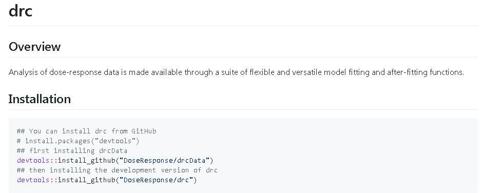
</center>


---
class: inverse right middle title-slide2

# Menús de RStudio (OPCIONAL)


---
# Menús de RStudio: File

<center>

</center>

---
# Menús de RStudio: Edit

<center>

</center>

---
# Menús de RStudio: Code

<center>

</center>

---
# Menús de RStudio: View

<center>

</center>


---
# Menús de RStudio: Plots

<center>

</center>


---
# Menús de RStudio: Session

<center>

</center>

---
# Menús de RStudio: Build

<center>

</center>


---
# Menús de RStudio: Debug

<center>

</center>


---
# Menús de RStudio: Profile

<center>

</center>

---
# Menús de RStudio: Tools

<center>

</center>

---
# Menús de RStudio: Help

<center>

</center>


---
class: inverse right middle title-slide2

# Proyectos en RStudio (OPCIONAL)

---
# Proyectos en RStudio: Crear un proyecto


.pull-left[
* A veces tenemos muchos trabajos con R y no queremos mezclar los scripts, los datos, etc... (por ejemplo, diferentes asignaturas o proyectos de trabajo). Incluso, no nos gustar mezclar objetos de diferentes trabajos en el mismo espacio.

* Rstudio nos da la posibilidad de crear para cada trabajo un proyecto y, así, tenerlo todo bien organizado.
]


.pull-right[
<center>
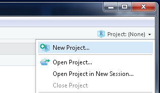
</center>

<center>
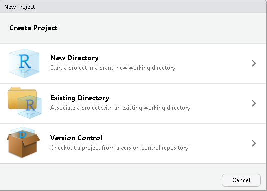
</center>
]


<center>
<table>
<tr>
<td>
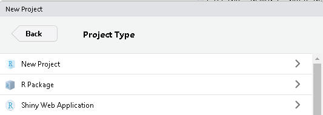
</td>
<td>
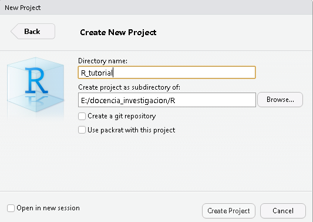
</td>
</tr>
</table>
</center>

---
# Proyectos en RStudio: Crear un proyecto


* El proyecto nos permite tener todo lo relacionado con un trabajo en una misma carpeta diferenciado de otros trabajos.
<center>
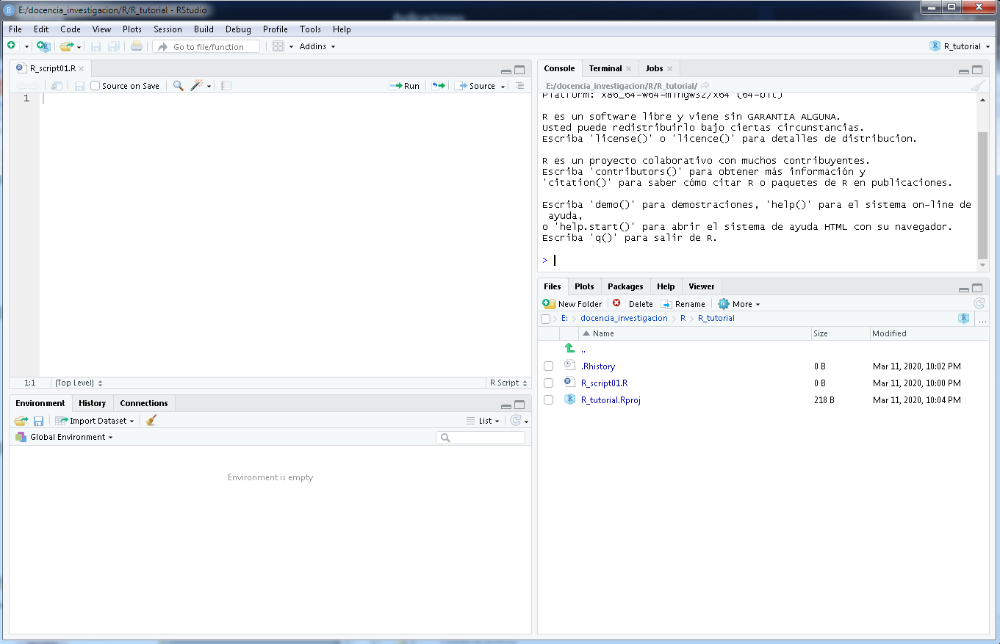
</center>

---
# Proyectos en RStudio: Crear un proyecto

* Si cerramos nuestra sesión de Rstudio o nuestro proyecto, la próxima vez que volvamos a abrirlo nos recupera todos los objetos que hemos ido creando durante nuestro trabajo. Si queremos borrarlos todos, hacemos click en el icono de la escoba.
<center>

</center>

* Al volver a iniciar RStudio abrirá por defecto el último proyecto en el que hayamos estado trabajando.


---
class: inverse, mline, center, middle

# Gracias


Esta presentación se ha creado con la librería [**xaringan**](https://github.com/yihui/xaringan),
utilizando [remark.js](https://remarkjs.com), [**knitr**](http://yihui.org/knitr), y [R Markdown](https://rmarkdown.rstudio.com).
