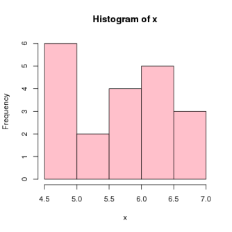
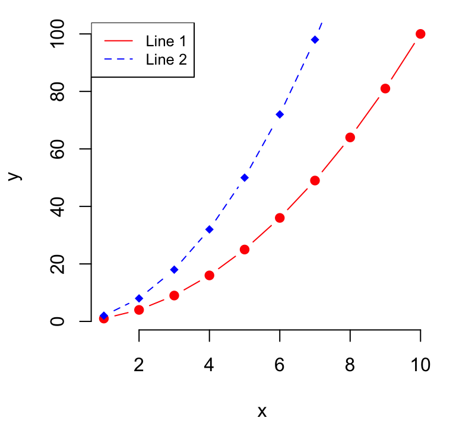
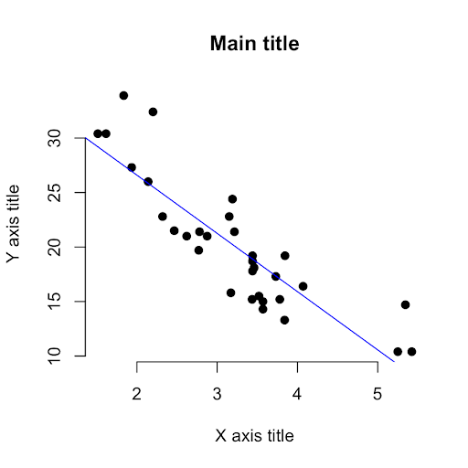
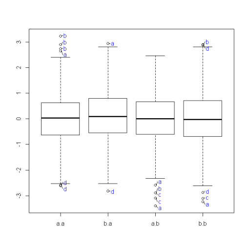
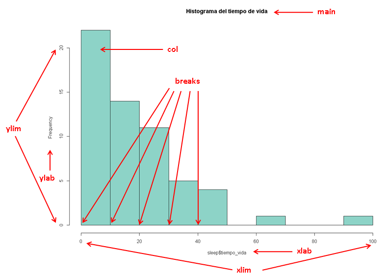

# Visualización básica

* En R hay una serie de gráficas básicas que podemos obtener de forma sencilla
   + Histograma
   + Gráfico de barras
   + Gráfico de cajas
   + Gráfico de líneas
   + Gráfico de dispersión
  
<div >
  <div >
    
    
     
  </div>
  <div >
        
        
  </div>
</div>


---

# Visualización básica: Las librerías graphics y lattice

* La librería `graphics` se carga por defecto cuando se comienza una sesión de R. 

* Sin embargo, existe diferentes alternativas en R que nos ayudarán a obtener gráficos con mayor nivel de complejidad.

* En este sentido, la librería `lattice` nos ofrece alternativas a cada uno de los gráficos básicos con `graphics`.

* En estas librerías disponemos de los siguientes métodos para realizar las gráficas que hemos comentado:
   + Para representar un histograma tenemos las funciones `hist` o `histogram`
   + El gráfico de barras se obtiene con `barplot` o `barchart`
   + Un gráfico de cajas lo obtenemos con `boxplot` o `bwplot`
   + Para el gráfico de dispersión utilizaremos `plot`
   
---

# Visualización básica


* Vamos a explicar los gráficos anteriores utilizando un conjunto de datos sobre el sueño en mamíferos y su exposición a peligros durante su descanso.

<table><tr>
<td>

</td>
<td>

</td>
<td>

</td>
</tr></table>

---

# Visualización básica

* Las variables son las siguientes
  * especie: especie mamífero
  * peso_cuerpo: peso del cuerpo en kg.
  * peso_cerebro: peso del cerebro en kg.
  * no_suenho: horas de descanso sin sueño
  * suenho: horas de descanso con sueño
  * descanso: tiempo total de descanso (domir) 
  * tiempo_vida: tiempo de vida en años
  * tiempo_gestacion: tiempo de gestación en días
  * predacion: índice de predación (1: menos expuesto a ser depredado - 5: más probable de ser depredado) 
  * exposicion: índice de esposición mientras duerme (1: menos expuesto - 5: más expuesto)
  * peligro: índice de peligro que enfrenta al encarar a otros animales (1: menos peligro de otros animales - 5: más peligro de otros animales).
  

```{r data01, echo = FALSE, eval=FALSE, fig.height=5}
# leer datos de sueño
sleep<-read.table("data/datos_sleep.txt",header=TRUE,sep="\t",quote="")

sleep$talla<-ifelse(sleep$peso_cuerpo<10, "little size",ifelse(sleep$peso_cuerpo<200,"normal size","large size"))
sleep$predacion<-ifelse(sleep$predacion<3, "less preyed",ifelse(sleep$predacion<5,"moderate preyed","more preyed"))
sleep$exposicion<-ifelse(sleep$exposicion<3, "less exposed",ifelse(sleep$exposicion<5,"moderate exposed","more exposed"))
sleep$peligro<-ifelse(sleep$peligro<3, "less danger",ifelse(sleep$peligro<5,"moderate danger","more danger"))
write.table(sleep,file="data/datos_sleep2.txt",row.names = FALSE, quote=FALSE,sep="\t")
```

```{r data02, echo = TRUE, fig.height=5}
# leer datos de sueño
sleep<-read.table("data/datos_sleep2.txt",header=TRUE,sep="\t",quote="")
```


---

# Visualización básica: histograma (graphics)

* El histogram es el gráfico que nos ayuda a representar los valores de una variable agrupada en intervalos (breaks) y muestra la distribución de frecuencias en estos intervalos. 

```{r hist01, echo = FALSE, fig.height=5, fig.align = 'center'}
# leer datos calidad aire
#aire<-read.table("data/datos_calidad_aire.csv",header=TRUE)
#hist(aire$Temp,col="#8DD3C7",main="Histograma de temperatura")
```

```{r hist02, echo = TRUE,eval=FALSE, fig.height=5, fig.align = 'center'}
hist(sleep$tiempo_vida,col="#8DD3C7",main="Histograma del tiempo de vida")
```



---

# Visualización básica: histograma (graphics)

* Podemos personalizar diferentes características del histograma como los intervalos de clase. Especificando la opción  `freq=TRUE` obtenemos un histograma de frecuencias absolutas.

```{r hist03, echo = TRUE, fig.height=5, fig.align = 'center'}
hist(sleep$tiempo_vida,col="#8DD3C7", freq=TRUE,
     breaks=c(0,20,40,60,80,100),
     xlab="Tiempo de vida",ylab="Frecuencias absolutas",
     main="Histograma del tiempo de vida")
```


---

# Visualización básica: histograma (graphics)

* Si queremos agregar una curva de densidad de distribución normal, sólo tenemos que generar
el histograma con la opción `freq=FALSE` y luego añadir con el comando `curve` una curva normal con media y varianza de la variable que estamos representando.

.pull-left[

```{r hist06a, echo = TRUE, eval=FALSE}
h1<-hist(sleep$tiempo_vida,col="#8DD3C7", 
         freq=FALSE,
     breaks=c(0,20,40,60,80,100),
     xlab="Tiempo de vida",
     ylab="Densidad de probabilidad",
     main="Histograma del tiempo de vida")
curve(dnorm(x, 
            mean=mean(sleep$tiempo_vida,na.rm=TRUE), 
            sd=sd(sleep$tiempo_vida,na.rm=TRUE)), 
      add=TRUE, col="purple")
```
]


.pull-right[
```{r hist06b, echo = FALSE, fig.height=5, fig.align = 'center'}
h1<-hist(sleep$tiempo_vida,col="#8DD3C7", freq=FALSE,
     breaks=c(0,20,40,60,80,100),
     xlab="Tiempo de vida",ylab="Densidad de probabilidad",
     main="Histograma del tiempo de vida")
curve(dnorm(x, 
            mean=mean(sleep$tiempo_vida,na.rm=TRUE), 
            sd=sd(sleep$tiempo_vida,na.rm=TRUE)), 
      add=TRUE, col="purple")
```
]


---
class: normal remark-code
# Visualización básica: histograma (graphics)


* Observamos que `hist` retorna no sólo un gráfico sino un objeto lista con diferentes atributos del gráfico.

```{r hist04, echo = TRUE, size="tiny", fig.align = 'center'}
h1
```

---

# Visualización básica: histograma (graphics)

* Si queremos representar un histograma de frecuencias relativas tenemos que dividir los `counts` por la suma total.

```{r hist05, echo = TRUE, fig.height=5, fig.align = 'center'}
h1$counts<-h1$counts/sum(h1$counts)
plot(h1,col="#8DD3C7", 
     xlab="Tiempo de vida",ylab="Frecuencias relativas",
     main="Histograma del tiempo de vida")
```


---

# Visualización básica: histograma (lattice)

* Como se ha comentado previamente, la librería `lattice` nos puede ayudar a elaborar gráficos más sofisticados, por ejemplo, desagregando por grupos.

* En este caso, se utiliza el comando `histogram(x)` donde `x` es la variable a representar.

.pull-left[

```{r hist07a, echo = TRUE, eval=FALSE}
library(lattice)

histogram(sleep$tiempo_gestacion, 
          type ="count",
          xlab="Tiempo de gestación",
          ylab="Frecuencias absolutas",
          main="Histograma del tiempo de vida")
```
]


.pull-right[
```{r hist07b, echo = FALSE, fig.height=5, fig.align = 'center'}
library(lattice)

histogram(sleep$tiempo_gestacion, 
          type ="count",
          xlab="Tiempo de gestación",ylab="Frecuencias absolutas",
          main="Histograma del tiempo de vida")
```
]

---

# Visualización básica: histograma (lattice)

* Sin embargo, en `lattice` podemos ejecutar el comando como `histogram(formula,data)` asignando el conjunto de datos en el argumento `data` y especificando las variables en `formula` de la siguiente manera:

  * `~ x | g1 * g2 * ...` : Representamos la variable `x` (numérica) desagregada por las variables `g1`, `g2`, .... (factores) de forma opcional.
  
  * `y ~ x | g1 * g2 * ...` o `x ~ y | g1 * g2 * ...` : Representamos las variable `x` e `y` (numéricas) desagregadas por las variables `g1`, `g2`, .... (factores) de forma opcional.
  
* También se pueden separar los factores `g1`, `g2`, .... mediante `+` en lugar de `*` y el resultado sería el mismo. 


.pull-left[

```{r hist08a, echo = TRUE, eval=FALSE}
library(lattice)

histogram(~ tiempo_gestacion, data = sleep,
          type ="count",
          xlab="Tiempo de gestación",
          ylab="Frecuencias absolutas",
          main="Histograma del tiempo de vida")
```
]


.pull-right[
```{r hist08b, echo = FALSE, fig.height=5, fig.align = 'center'}
library(lattice)

histogram(~ tiempo_gestacion, data = sleep,
          type ="count",
          xlab="Tiempo de gestación",ylab="Frecuencias absolutas",
          main="Histograma del tiempo de vida")
```
]


---

# Visualización básica: histograma (lattice)

* Veamos cómo hacer el histograma desagrupando de acuerdo a la variable `peligro`

```{r hist09, echo = TRUE, fig.height=5, fig.align = 'center'}
#sleep$peligro<-factor(sleep$peligro)
histogram(~ tiempo_gestacion | peligro, data = sleep,
          type ="count",
          xlab="Tiempo de gestación",ylab="Frecuencias absolutas",
          main="Histograma del tiempo de gestación por nivel de peligro",
          layout=c(2,2))
```

---

# Visualización básica: histograma (lattice)

* Representar un histograma de la variable `descanso` condicionada por el factor `predacion`

```{r hist10, echo = FALSE, fig.height=5, fig.align = 'center'}
#sleep$peligro<-factor(sleep$peligro)
histogram(~ descanso | predacion, data = sleep,
          type ="count",
          xlab="Tiempo de descanso",ylab="Frecuencias absolutas",
          main="Histograma del tiempo de descanso por nivel de riesgo de predación",
          layout=c(2,2))
```
```{r hist11, echo = TRUE,eval=FALSE, fig.height=5, fig.align = 'center'}
#sleep$peligro<-factor(sleep$peligro)
histogram(~ ... | ..., data = sleep,
          type ="count",
          xlab="....",ylab="Frecuencias absolutas",
          main="Histograma del ... por ...")
```

---

class: normal remark-code
# Visualización básica: gráfico de barras (graphics)

* El gráfico de barras compara valores de una variable frente a otra de tipo nominal.


.pull-left[
```{r bar01a, echo = FALSE, fig.height=5, fig.align = 'center'}
# leer datos pasajeros
#pasajeros<-read.table("data/datos_pasajeros.csv",header=TRUE)
#pasajeros$mes<-zoo::as.yearmon(as.character(pasajeros$mes),"%Y-%m")
#plot(pasajeros,col="blue",main="Evolución de pasajeros")
```

```{r bar02a, echo = TRUE, eval=FALSE}
# aggregate es un comando que se utiliza para crear
# tablas desagregadas de acuerdo a variables de una lista
tab_peligro<-aggregate(sleep$peso_cerebro, 
                       list(sleep$peligro), mean,na.rm=TRUE)
colnames(tab_peligro)<-c("peligro","promedio_cerebro")


barplot(promedio_cerebro~peligro,
        data=tab_peligro,
        col="#8DD3C7",
        main="Comparación peso medio cerebro según nivel peligro")
```
]


.pull-right[


```{r bar02b, echo = FALSE, fig.height=5, fig.align = 'center'}
# aggregate es un comando que se utiliza para crear
# tablas desagregadas de acuerdo a variables de una lista
tab_peligro<-aggregate(sleep$peso_cerebro, list(sleep$peligro), mean,na.rm=TRUE)
colnames(tab_peligro)<-c("peligro","promedio_cerebro")


barplot(promedio_cerebro~peligro,
        data=tab_peligro,
        col="#8DD3C7",main="Comparación del peso medio cerebro según nivel de peligro")
```
]


---


# Visualización básica: gráfico de barras (lattice)

* La librería `lattice` también permite generar gráficos de barras con `barchart`

```{r bar03, echo = TRUE, fig.height=5, fig.align = 'center'}
barchart(promedio_cerebro~peligro,
        data=tab_peligro,
        col="#8DD3C7",main="Comparación del peso medio cerebro según nivel de peligro")
        
```

* En este caso, además, podemos representar las barras en horizontal cambiando la fórmula `promedio_cerebro~peligro` por `peligro~promedio_cerebro`.

---


# Visualización básica: gráfico de barras (lattice)

* También podemos especificar una variable para desagrupar los diagramas de barras

```{r bar04, echo = TRUE, fig.height=5, fig.align = 'center'}
tab_peligro<-aggregate(sleep$peso_cerebro, list(sleep$peligro,sleep$talla), mean,na.rm=TRUE)
colnames(tab_peligro)<-c("peligro","talla","promedio_cerebro")

barchart(promedio_cerebro~peligro | talla ,
        data=tab_peligro,
        col="#8DD3C7",main="Comparación del peso medio cerebro según nivel de peligro por talla del animal")
        
```

* __IMPORTANTE__: Recordar que puede se necesario convertir a variable factor y ordenar los niveles antes de generar las tablas y los gráficos
```{r bar05, echo = TRUE, eval=FALSE, fig.height=5, fig.align = 'center'}
sleep$talla<-factor(sleep$talla,levels=c("little size", "normal size","large size"))
# repetir las instrucciones de la tabla y el gráfico
```

---


# Visualización básica: gráfico de barras (lattice)

* Representar ahora en diagrama de barras el peso del cerebro frente al nivel de peligro desagregado por talla del animal y nivel de riesgo de predacion
```{r bar06, echo = FALSE, fig.height=5, fig.align = 'center'}
tab_peligro<-aggregate(sleep$peso_cerebro, list(sleep$peligro,sleep$talla,sleep$predacion), mean,na.rm=TRUE)
colnames(tab_peligro)<-c("peligro","talla","predacion","promedio_cerebro")

barchart(promedio_cerebro~peligro | talla + predacion,
        data=tab_peligro,
        col="#8DD3C7",main="Comparación del peso medio cerebro según nivel de peligro por talla del animal y nivel de riesgo de predación")
        
```
```{r bar06b, echo = TRUE,eval=FALSE, fig.height=5, fig.align = 'center'}
tab_peligro<-aggregate(sleep$..., list(sleep$peligro,...,...), mean,na.rm=TRUE)
colnames(tab_peligro)<-c("peligro","...","...","promedio_cerebro")

barchart(...~peligro | ... ,
        data=tab_peligro,
        col="#8DD3C7",main="Comparación del peso medio cerebro según nivel de peligro por ...")
        
```

---

# Visualización básica: gráfico de cajas (graphics)

* El gráfico de cajas es uno de los gráficos más ampliamente utilizados para ver la forma de la distribución de una variable y la posible presencia de valores atípicos. Vamos a verlo con la variable descanso.

```{r cajas01, echo = FALSE, fig.height=5, fig.align = 'center'}
# leer datos pasajeros
#pasajeros<-read.table("data/datos_pasajeros.csv",header=TRUE)
#pasajeros$mes<-zoo::as.yearmon(as.character(pasajeros$mes),"%Y-%m")
#plot(pasajeros,col="blue",main="Evolución de pasajeros")
```

```{r cajas02, echo = TRUE, fig.height=5, fig.width=8,fig.align = 'center'}
boxplot(sleep$descanso, 
        ylab = 'Descanso (en horas)',      # Adds label to y-axis
        col="#8DD3C7",                     # Adds colour
        ylim = c(0,30),                   # Changes axis limits
        main = "Boxplot de horas de descanso")  # Adds title
  
        
```

---


# Visualización básica: gráfico de cajas (lattice)

* Representar el gráfico de tiempo de descanso comparando el nivel de peligro, y desagrupando por talla, mediante el comando `bwplot` de `lattice`.

```{r cajas04, echo = TRUE, eval=FALSE,fig.height=5, fig.width=8,fig.align = 'center'}
bwplot(...~peligro | ..., data=sleep, 
        xlab = '...',                  # Adds label to x-axis
        ylab = '...',                  # Adds label to y-axis
        col="#8DD3C7",                 # Adds colour
        main = "Boxplot de horas de descanso según nivel de peligro por ....")  # Adds title        
        
```
```{r cajas04b, echo = FALSE, eval=TRUE, fig.height=5, fig.width=8,fig.align = 'center'}
bwplot(descanso~peligro | talla, data=sleep, 
        xlab = 'Peligro',                  # Adds label to x-axis
        ylab = 'Descanso (en horas)',      # Adds label to y-axis
        col="#8DD3C7",                     # Adds colour
        ylim = c(0,30),                    # Changes axis limits
        main = "Boxplot de horas de descanso según nivel de peligro por talla del animal")  # Adds title        
        
```
---

# Visualización básica: gráfico de líneas (el comando plot)

* El gráfico de líneas es idóneo para analizar tendencias o cambios relativos en las cantidades en los datos a lo largo del tiempo (o de cualquier otra variable).

```{r line02, echo = FALSE, fig.height=5, fig.align = 'center'}
# leer datos pasajeros
#pasajeros<-read.table("data/datos_pasajeros.csv",header=TRUE)
#pasajeros$mes<-zoo::as.yearmon(as.character(pasajeros$mes),"%Y-%m")
#plot(pasajeros,col="blue",main="Evolución de pasajeros")
```

```{r line03, echo = TRUE, fig.height=5, fig.align = 'center'}
sleep_dep<-read.table("data/datos_sleep_deporte.csv",header=TRUE)
sleep_dep$dia<-as.Date(sleep_dep$dia,format="%d-%b-%y")

plot(sleep_dep$dia,sleep_dep$dormido ,col="blue",
     main="Evolución del descanso según día",
     xlab="Día",
     ylab="Descanso",
     type="l")
```


---

# Visualización básica: gráfico de dispersión (el comando plot)

* Como se acaba de ver, el comando `plot` permite obtener un sencillo gráfico de líneas. Pero este comando admite bastantes opciones personalizadas cuando lo utilizamos para gráficos de dispersión. 
```{r scatter01, echo = TRUE, fig.height=5, fig.align = 'center'}
plot(sleep$suenho,sleep$descanso ,col="blue",
     main="Relación entre sueño y tiempo total de descanso",
     xlab="Tiempo de sueño",
     ylab="Descanso")
```

---

# Visualización básica: gráfico de dispersión (el comando plot)

* Existen varios argumentos de `plot` que pueden ser muy interesantes para mejorar el gráfico.
  * __tipo de punto__: Se configura con el argumento `pch` de plot (ayuda en ?points)
  ```{r plot01, echo = FALSE, fig.height=3, fig.align = 'center'}
  generateRPointShapes<-function(){
    oldPar<-par()
    par(font=2, mar=c(0.5,0,0,0))
    y=rev(c(rep(1,6),rep(2,5), rep(3,5), rep(4,5), rep(5,5)))
    x=c(rep(1:5,5),6)
    plot(x, y, pch = 0:25, cex=1.5, ylim=c(1,5.5), xlim=c(1,6.5), 
         axes=FALSE, xlab="", ylab="", bg="blue")
    text(x, y, labels=0:25, pos=3)
    par(mar=oldPar$mar,font=oldPar$font )
  }
  generateRPointShapes()
  ```
  * __tipo de línea__: Se configura con el argumento `lty` de plot (ayuda en ?points)
  
  
  ```{r plot02, echo = FALSE, fig.height=3, fig.align = 'center'}
  generateRLineTypes<-function(){
    oldPar<-par()
    par(font=2, mar=c(0,0,0,0))
    plot(1, pch="", ylim=c(0,6), xlim=c(0,0.7),  axes=FALSE,xlab="", ylab="")
    for(i in 0:6) lines(c(0.3,0.7), c(i,i), lty=i, lwd=3)
    text(rep(0.1,6), 0:6, labels=c("0.'blank'", "1.'solid'", "2.'dashed'", "3.'dotted'",
                                   "4.'dotdash'", "5.'longdash'", "6.'twodash'"))
    par(mar=oldPar$mar,font=oldPar$font )
  }
  generateRLineTypes()
  ```

---

# Visualización básica: gráfico de dispersión (el comando plot)

* También podemos cambiar otros atributos: 
* `cex`: argumento para controlar el __tamaño del punto__ (valor por defecto a 1).
* `lwd`: argumento para controlar el __grosor de línea__ (valor por defecto a 1).
* `col`: argumento para controlar el __color__ (ayuda en ?colors)

```{r plot03, echo = FALSE, fig.height=6, fig.align = 'center'}
generateRMapColors<-function() {
  # No margin around chart
  par(mar=c(0,0,0,0))
  
  # Empty chart
  plot(0, 0, type = "n", xlim = c(0, 1), ylim = c(0, 1), axes = FALSE, xlab = "", ylab = "")
  
  # Settings
  line <- 25
  col <- 5
  
  # Add color background
  rect(  
    rep((0:(col - 1)/col),line) ,  
    sort(rep((0:(line - 1)/line),col),decreasing=T),   
    rep((1:col/col),line) , 
    sort(rep((1:line/line),col),decreasing=T),  
    border = "white" , 
    col=colors()[seq(1,line*col)])
  
  # Color names
  text(  
    rep((0:(col - 1)/col),line)+0.1 ,  
    sort(rep((0:(line - 1)/line),col),decreasing=T)+0.015 , 
    colors()[seq(1,line*col)]  , 
    cex=1)
}
generateRMapColors()
```


---

# Visualización básica: gráfico de dispersión (el comando plot)

* Representar las variable `peso_cerebro` frente a `tiempo_vida` con algún color, tipo de punto 20 y tamaño del punto a 1.5:

```{r scatter02, echo = TRUE,eval=FALSE, fig.height=5, fig.align = 'center'}
plot(sleep$...,sleep$... ,col="...",pch=...,cex=...,
     main="Relación entre peso de cerebro y tiempo de vida",
     xlab="Peso de cerebro (kg.)",
     ylab="Tiempo de vida (años)")
```
```{r scatter03, echo = FALSE, fig.height=5, fig.align = 'center'}
plot(sleep$peso_cerebro,sleep$tiempo_vida,col="darkorange",pch=20,cex=1.5,
     main="Relación entre peso de cerebro y tiempo de vida",
     xlab="Peso de cerebro (kg.)",
     ylab="Tiempo de vida (años)")
```


---

# Visualización básica: gráfico de dispersión (el comando plot)

* Podemos incluir elementos en un gráfico utilizando una combinación de instrucciones.

* Por ejemplo, si queremos añadir una línea al gráfico hacemos los siguiente con el comando `abline` al que le podemos pasar los argumentos ´h´ o ´v´ para un línea horizontal o vertical, respectivamente:

.pull-left[


```{r scatter04a, echo = TRUE,eval=FALSE}
plot(sleep$suenho,sleep$descanso ,col="blue",pch=20,
     main="Relación entre sueño y tiempo total de descanso",
     xlab="Tiempo de sueño",
     ylab="Descanso")
abline(v=sleep$suenho[sleep$especie=="..."],
       col="red",lty="dashed")
abline(h=sleep$descanso[sleep$especie=="..."],
       col="red",lty="dashed")
```
]


.pull-right[

```{r scatter04b, echo = FALSE,eval=TRUE, fig.height=5, fig.align = 'center'}
plot(sleep$suenho,sleep$descanso ,col="blue",pch=20,
     main="Relación entre sueño y tiempo total de descanso",
     xlab="Tiempo de sueño",
     ylab="Descanso")
abline(v=sleep$suenho[sleep$especie=="..."],col="red",lty="dashed")
abline(h=sleep$descanso[sleep$especie=="..."],col="red",lty="dashed")
```
]


---

# EJERCICIO: Gráfico con el comando plot

* En los E.E.U.U. suele ser habitual la realización de sondeos para conocer la valoración de los presidentes entrre los ciudadanos (`approval ratings`)

<center>

</center>

```{r exe01, echo = TRUE, eval=TRUE}
bush<-read.csv("data/data_bush.csv")
bush$fecha<-as.Date(bush$fecha)
bush<-bush[bush$agencia=="gallup",]
```

* Realizar un gráfico para representar la evolución en el tiempo del rating de Bush 
```{r exe02, echo = FALSE, eval=FALSE}
with(bush,plot(fecha,rating,type="o",pch=20,col="blue"))
fechas<-as.Date(c("2001-09-11","2003-03-20","2003-12-13"))
abline(v=fechas[1],lty=2,col="red")
abline(v=fechas[2],lty=2,col="red")
abline(v=fechas[3],lty=2,col="red")
text(x=fechas[1]-30, y=80, labels="11-S")
text(x=fechas[2]-30, y=80, labels="Invasión Irak")
text(x=fechas[3]-30, y=80, labels="Captura S. Hussein")
```


---

# SOLUCIÓN EJERCICIO: Gráfico con el comando plot

* En los E.E.U.U. suele ser habitual la realización de sondeos para conocer la valoración de los presidentes entrre los ciudadanos (`approval ratings`)

<center>

</center>


.pull-left[

```{r exe01sol, echo = TRUE, eval=FALSE}
bush<-read.csv("data/data_bush.csv")
bush$fecha<-as.Date(bush$fecha)
bush<-bush[bush$agencia=="gallup",]


with(bush,plot(fecha,rating,type="o",pch=20,col="blue"))
fechas<-as.Date(c("2001-09-11","2003-03-20","2003-12-13"))
abline(v=fechas[1],lty=2,col="red")
abline(v=fechas[2],lty=2,col="red")
abline(v=fechas[3],lty=2,col="red")
text(x=fechas[1]-30, y=80, labels="11-S")
text(x=fechas[2]-30, y=80, labels="Invasión Irak")
text(x=fechas[3]-30, y=80, labels="Captura S. Hussein")

```
]


.pull-right[

```{r exe02sol, echo = FALSE, eval=TRUE}
with(bush,plot(fecha,rating,type="o",pch=20,col="blue"))
fechas<-as.Date(c("2001-09-11","2003-03-20","2003-12-13"))
abline(v=fechas[1],lty=2,col="red")
abline(v=fechas[2],lty=2,col="red")
abline(v=fechas[3],lty=2,col="red")
text(x=fechas[1]-30, y=80, labels="11-S")
text(x=fechas[2]-30, y=80, labels="Invasión Irak")
text(x=fechas[3]-30, y=80, labels="Captura S. Hussein")
```
]


---

# Visualización básica: algunos comandos de utilidad

* Se puede comprobar en lo que hemos visto hasta el momento que hay algunos comandos (por ejemplo, de la librería `lattice`) que nos permite especiificar el argumento `data` y luego sólo hay que especificar las variables sin necesidad de especificar `data$...`.

* En otros comandos (como `hist` y `plot`) esto no es así y habría que especificar `data$...` para referirnos a las variables.

* Una posible solución sería utilizar el comando `attach`, que crea una copia en memoria de las variables de un dataset y así referirnos a ellas directamente por el nombre.
```{r scatter05, echo = TRUE,eval=FALSE, fig.height=5, fig.align = 'center'}
attach(sleep)
plot(peso_cerebro,tiempo_vida)
```

---

# Visualización básica: algunos comandos de utilidad

* Otra alternativa sería el comando with que permite anteponer el nombre de un dataset antes de la ejecución de un comando dado.
```{r scatter06, echo = TRUE,eval=FALSE, fig.height=5, fig.align = 'center'}
with(sleep, 
     plot(peso_cerebro,tiempo_vida)
)

with(sleep, 
     hist(peso_cerebro)
)
```

* Esta última alternativa es más clara ya que permite ver en todo momento a qué dataset pertenecen las variables.


---

# Visualización básica: gráfico de dispersión (el comando plot)

* Vamos a añadir una recta de regresión lineal de `descanso` frente a `suenho` ajustando primero el modelo lineal con el comando `lm(formula, data)`:
```{r scatter07, echo = TRUE,eval=FALSE, fig.height=5, fig.align = 'center'}
linreg<-lm(...~...,data=sleep)
linreg
```

```{r scatter08, echo = FALSE,eval=TRUE, fig.height=5, fig.align = 'center'}
linreg<-lm(descanso~suenho,data=sleep)
linreg
```


---

# Visualización básica: gráfico de dispersión (el comando plot)

* Y, ahora, podemos utilizar el argumento `reg` del comando `plot`:
```{r scatter09, echo = TRUE,eval=FALSE, fig.height=5, fig.align = 'center'}
with(sleep,
     plot(suenho,descanso ,col="blue",pch=20,
     main="Relación entre sueño y tiempo total de descanso",
     xlab="Tiempo de sueño",
     ylab="Descanso")
)
abline(....,col="blue",lty="dotdash")
```
```{r scatter10, echo = FALSE,eval=TRUE, fig.height=5, fig.align = 'center'}
with(sleep,
     plot(suenho,descanso ,col="blue",pch=20,
     main="Relación entre sueño y tiempo total de descanso",
     xlab="Tiempo de sueño",
     ylab="Descanso")
)
abline(reg=linreg,col="green",lty="dotdash")
```

---

# Visualización básica: gráfico de dispersión (el comando plot)

* Observar que podemos diferenciar por grupos de un factor:
```{r scatter11, echo = TRUE,eval=FALSE, fig.height=5, fig.align = 'center'}
with(sleep,
     plot(suenho,descanso ,col=peligro,pch=20,
     main="Relación entre sueño y tiempo total de descanso",
     xlab="Tiempo de sueño",
     ylab="Descanso")
)

```
```{r scatter12, echo = FALSE,eval=TRUE, fig.height=5, fig.align = 'center'}
sleep$talla<-factor(sleep$talla,levels=c("little size", "normal size","large size"))
color_punto<-c("red","blue","green")
with(sleep,
     plot(suenho,descanso ,col=color_punto[talla],pch=20,
     main="Relación entre sueño y tiempo total de descanso",
     xlab="Tiempo de sueño",
     ylab="Descanso")
)

```


---

# Visualización básica: gráfico de dispersión (el comando plot)

* En este gráfico se necesita una leyenda para aclarar a qué grupo pertenece cada color.

* El comando `legend(x,y,...)` nos puede ayudar a colocar una leyenda en unas coordenadas `(x,y)`
o en una de las siguientes posiciones `x`:

<center>

</center>

---

# Visualización básica: gráfico de dispersión (el comando plot)

* Por tanto, veamos cómo añadir la leyenda:
  * Crear un vector `color_punto` para el color de cada grupo
  * En el argumento `col` de `plot` hay que especificar un vector con los colores de cada punto. Dicho vector es de la forma `color_punto[talla]`
  * Finalmente, especificar la leyenda en un lugar adecuado del gráfico y especificar en `levels` los niveles de la variable de grupo, es decir, `levels(talla)`, y en `col` el color que ha de tener cada valor de la leyenda.

```{r scatter13, echo = TRUE,eval=FALSE, fig.height=5, fig.align = 'center'}
color_punto<-c("...","...","...") # especificar el color deseado 
                                  # para cada nivel de peligro
with(sleep,
     plot(suenho,descanso ,col=...,pch=20,   # especificar el vector de colores 
                                             # de cada punto
          main="Relación entre sueño y tiempo total de descanso",
          xlab="Tiempo de sueño",
          ylab="Descanso")
)
with(sleep,
     legend("bottomright",pch=20,
            legend=...,
            col=...))

```

---

# Visualización básica: gráfico de dispersión (el comando plot)

* El resultado final:

```{r scatter14, echo = FALSE,eval=TRUE, fig.height=7, fig.align = 'center'}
color_punto<-c("red","blue","green")
with(sleep,
     plot(suenho,descanso ,col=color_punto[talla],pch=20,
          main="Relación entre sueño y tiempo total de descanso",
          xlab="Tiempo de sueño",
          ylab="Descanso")
)
with(sleep,
     legend("bottomright",pch=20,
            legend=levels(talla),
            col=color_punto))

```


---

# Visualización básica: gráfico de dispersión (el comando plot)

* Representar las variable `tiempo_gestacion` frente a `tiempo_vida` diferenciado por colores en los grupos de la variable `peligro`, tipo de punto 20 y tamaño del punto a 1.5:

```{r scatter15, echo = TRUE, eval=FALSE, fig.height=7, fig.align = 'center'}
color_punto<-c("...","...","...")
with(...,
     plot(..., ... , col=..., pch=..., cex=...,
          main="Relación entre .... y ...",
          xlab="...",
          ylab="...")
     )
with(...,
     legend("bottomright",pch=20,
            legend=levels(...),
            col=...
            )
     )

```

```{r scatter16, echo = FALSE,eval=FALSE, fig.height=7, fig.align = 'center'}
color_punto<-c("red","chocolate","blueviolet")
with(sleep,
     plot(tiempo_gestacion,tiempo_vida ,col=color_punto[peligro],pch=20,cex=1.5,
          main="Relación entre tiempo de gestacion y tiempo de vida",
          xlab="Tiempo de vida",
          ylab="Tiempo de gestacion")
)
with(sleep,
     legend("bottomright",pch=20,
            legend=levels(peligro),
            col=color_punto))

```


---

# Visualización básica: gráfico de puntos (lattice)

* En `lattice` podemos encontrar la función `xyplot` para representar un gráfico de dispersion

```{r scatter17, echo = FALSE, eval=FALSE, fig.height=7, fig.align = 'center'}
sleep$talla<-as.factor(sleep$talla)
xyplot(suenho ~ descanso,
       group = talla,
       data=sleep,
       main="Relación entre sueño y decanso según la talla",
       pch=20,col=color_punto,cex=1.5,
       key=list(points =list(pch=20, col=color_punto),
                text = list(levels(sleep$talla))
                )
       )
```

```{r scatter18, echo = FALSE, eval=TRUE, fig.height=7, fig.align = 'center'}
xyplot(suenho ~ descanso,
       group = talla,
       data=sleep,
       main="Relación entre sueño y decanso según la talla",
       col=color_punto,
       auto.key=TRUE
       )
```

---

# Visualización básica: gráfico de puntos (lattice)

* Hay otros tipos de gráficos de puntos que pueden ser interesantes

```{r scatter19, echo = FALSE, eval=FALSE, fig.height=7, fig.align = 'center'}
sleep_little<-subset(sleep,talla=="little size")
dotplot(reorder(especie,descanso)~suenho+descanso,  
 data = sleep_little,
 pch = 20)
```

```{r scatter20, echo = TRUE, eval=TRUE, fig.height=7, fig.align = 'center'}
sleep_little<-subset(sleep,talla=="little size")
dotplot(especie~descanso,  
 data = sleep_little,
 pch = 20)
```

* Este gráfico es interesante si añadimos una ordenación por la variable que especificamos en el eje x. Para ello, cambiar `especie~descanso` por `reorder(especie,descanso)~suenho+descanso`


---

# Visualización básica: gráfico de puntos (lattice)

* En el gráfico de puntos se pueden incluir múltiples variables en la representación. Añadir la variable `suenho` a `descanso` en la representación

```{r scatter21, echo = FALSE, eval=FALSE, fig.height=7, fig.align = 'center'}
dotplot(reorder(especie,descanso)~suenho+descanso,  
 data = sleep_little,
 xlab="",
 col = c("red","blue"),pch = 20,
 key = list(points = list(col = c("red","blue"), pch = c(20, 20)),
  text = list(c("Sueño", "Descanso")),
  space = "bottom")
)
```

```{r scatter22, echo = TRUE, eval=FALSE, fig.height=7, fig.align = 'center'}
dotplot(...~...+descanso,  
 data = sleep_little,
 pch = 20)
```


